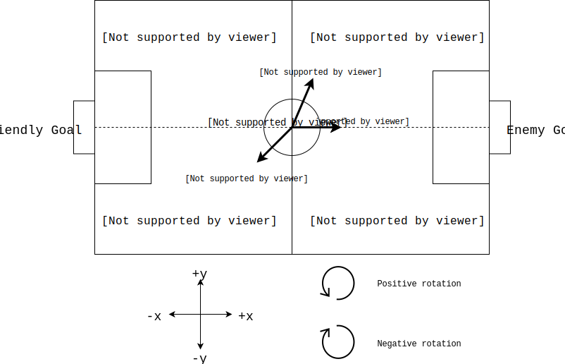

# Architecture and Design Rationales

# Table of Contents
* [Tools](#tools)
  * [SSL-Vision](#ssl-vision)
  * [SSL-Gamecontroller](#ssl-gamecontroller)
  * [grSim](#grsim)
* [Important Classes](#important-classes)
  * [World](#world)
    * [Team](#team)
    * [Robot](#robot)
    * [Ball](#ball)
    * [Field](#field)
    * [Refbox and Gamestate](#refbox--gamestate)
  * [Primitives](#primitives)
  * [Intents](#intents)
  * [Dynamic Parameters](#dynamic-parameters)
  * [Robot Status](#robot-status)
* [Design Patterns](#design-patterns)
  * [Abstract Classes and Inheritance](#abstract-classes-and-inheritance)
  * [Singleton Design Pattern](#singleton-design-pattern)
  * [Factory Design Pattern](#factory-design-pattern)
  * [Visitor Design Pattern](#visitor-design-pattern)
  * [Observer Design Pattern](#observer-design-pattern)
  * [C++ Templating](#c-templating)
* [Coroutines](#coroutines)
  * [What Are Coroutines?](#what-are-coroutines)
  * [What Coroutines Do We Use?](#what-coroutines-do-we-use)
  * [How Do We Use Coroutines?](#how-do-we-use-coroutines)
* [Conventions](#conventions)
  * [Coordinates](#coordinates)
  * [Angles](#angles)
  * [Diagram](#convention-diagram)
* [Architecture Overview](#architecture-overview)
  * [Diagram](#architecture-overview-diagram)
  * [Backend](#backend)
    * [Input](#input-responsibilities)
    * [Output](#output-responsibilities)
    * [Diagram](#backend-diagram)
  * [AI](#ai)
    * [Strategy](#strategy)
      * [Skills / Actions](#skills--actions)
      * [Tactics](#tactics)
      * [Plays](#plays)
    * [Navigation](#navigation)
    * [Diagram](#ai-diagram)
  * [Visualizer](#visualizer)


# Tools
A few commonly-used terms and tools to be familiar with:
#### SSL-Vision
  * This is the shared vision system used by the Small Size League. It is what connects to the cameras above the field, does the vision processing, and transmits the positional data of everything on the field to our AI computers.
  * The GitHub repository can be found [here](https://github.com/RoboCup-SSL/ssl-vision)
#### SSL-Gamecontroller
  * Sometimes referred to as the "Refbox", this is another shared piece of Small Size League software that is used to send gamecontroller and referee commands to the teams. A human controls this application during the games to send the appropriate commands to the robots. For example, some of these commands are what stage the gameplay is in, such as `HALT`, `STOP`, `READY`, or `PLAY`.
  * The GitHub repository can be found [here](https://github.com/RoboCup-SSL/ssl-game-controller)
#### grSim
  * The general robot simulator used by the Small-Size-League. We use this to manually test strategy since it is easy to place the robots and ball in desired locations, run a strategy, and see what the robots do. It is not perfectly accurate, but is useful for testing high-level logic.
  * The GitHub repository can be found [here](https://github.com/RoboCup-SSL/grSim)


# Important Classes
These are classes that are either heavily used in our code, or are very important for understanding how the AI works, but are _not_ core components of the AI or other major modules. To learn more about these core modules and their corresponding classes, check out the sections on the [Backend](#backend), [AI](#ai), and [Visualizer](#visualizer).

## World
The `World` class is what we use to represent the state of the world at any given time. In this context, the world includes the positions and orientations of all robots on the field, the position and velocity of the ball, the dimensions of the field being played on, and the current refbox commands. Altogether, it's the information we have at any given time that we can use to make decisions.

### Team
A team is a collection of [Robots](#robot)

### Robot
A Robot class represents the state of a single robot on the field. This includes its position, orientation, velocity, angular velocity, and any other information about its current state.

### Ball
The Ball class represents the state of the ball. This includes its position and velocity, and any other information about its current state.

### Field
The Field class represents the state of the physical field being played on, which is primarily its physical dimensions. The Field class provides many functions that make it easy to get points of interest on the field, such as the enemy net, friendly corner, or center circle. Also see the [coordinate convention](#coordinates) we use for the field (and all things on it).

### Refbox / GameState
These represent the current state of the game as dictated by the Gamecontroller. These provide functions like `isPlaying()`, `isHalted()` which tell the rest of the system what game state we are in, and make decisions accordingly. We need to obey the rules!


## Primitives
Primitives are very simple actions of things a robot can do. It does not represent or include _how_ these things are done. Some examples are:
* Moving in a straight line to a position
* Pivoting around a point
* Kicking the ball at a certain direction

Primitives act as the abstraction between our AI, and our robot firmware. It's much easier for our AI to send a `Primitive` to a robot telling it what it wants it to do, and have the robot responsible for making sure it does what it's told. For every `Primitive` in our `AI` software, there is an equivalent `Primitive` implementation in our robot firmware. When robots receive a `Primitive` command, they perform their own logic and control in order to perform the task specified by the `Primitive`.


## Intents
An `Intent` represents a simple thing the `AI` wants (or intends for) a robot to do. It does not represent or include _how_ these things are achieved. Some examples are:
* Moving to a position (without colliding with anything on its way)
* Pivoting around a point
* Kicking the ball at a certain direction or at a target

Intents are very similar to Primitives, but include slightly more logic. `Intents` can include extra parameters or data that `Primitives` do not, such as how much to avoid the ball by while moving. In this way, `Intents` are more "context-aware" than `Primitives`, and represent slightly higher-level commands.


## Dynamic Parameters
`Dynamic Parameters` are the system we use to change values in our code at runtime. The reason we want to change values at runtime is primarily because we may want to tweak our strategy or aspects of our gameplay very quickly. During games we are only allowed to touch our computers and make changes during halftime or a timeout, so every second counts! Using `Dynamic Parameters` saves us from having to stop the [AI](#ai), change a constant, recompile the code, and restart the [AI](#ai).

Additionally, we can use `Dynamic Parameters` to communicate between the [Visualizer](#visualizer) and the rest of our system. The [Visualizer](#visualizer) can change the values of `DynamicParameters` when buttons or menu items are clicked, and these new values will be picked up by the rest of the code. For example, we can define a `Dynamic Parameter` called `run_ai` that is a boolean value. Then when the `Start AI` button is clicked in the [Visualizer](#visualizer), it sets the value of `run_ai` to `true`. In the "main loop" for the [AI](#ai), it will check if the value of `run_ai` is true before running its logic. 

Here's a slightly more relevant example of how we used `Dynamic Parameters` during a game in RoboCup 2019. We had a parameter called `enemy_team_can_pass`, which indicates whether or not we think the enemy team can pass. This parameter was used in several places in our defensive logic, and specifically affected how we would shadow enemy robots when we were defending them. If we assumed the enemy team could pass, we would shadow between the robots and the ball to block any passes, otherwise we would shadow between the enemy robot and our net to block shots. During the start of a game, we had `enemy_team_can_pass` set to `false` but the enemy did start to attempt some passes during the game. However, we didn't want to use one of our timeouts to change the value. Luckily later during the half, the enemy team took a time out. Because `Dynamic Parameters` are very quick to change and can leave the `AI` running, we were quickly able to change `enemy_team_can_pass` to `true` while the enemy team took their time out. This made our defence much better against that team and didn't take to much time we had to burn our own timeout. Altogether this is an example of how we use `Dynamic Parameters` to control our [AI](#ai) and other parts of the code.

It is worth noting that constants are still useful, and should still be used whenever possible. If a value realistically doesn't need to be changed, it should be a constant (with a nice descriptive name) rather than a `Dynamic Parameter`. Having too many `Dynamic Parameters` is overwhelming because there are too many values to understand and change, and this can make it hard to tune values to get the desired behaviour while under pressure during a game.


## Robot Status
The `Robot Status` class contains information about the status of a single robot. Examples of the information they include are:
* Robot battery voltage
* Whether or not the robot senses the ball in the breakbeam
* The capacitor charge on the robot
* The temperature of the dribbler motor

Information received from the robots is stored in `Robot Status` objects so that the rest of the system can easily access and make sense of the information if necessary. For example, we monitor incoming `Robot Status` and display warnings in the [Visualizer](#visualizer) if anything looks wrong so we can be alerted. For example, during a game we may get a "Low battery warning" for a certain robot, and then we know to substitute it and replace the battery before it dies on the field.


# Design Patterns
Below are the main design patterns we use in our code, and what they are used for.

## Abstract Classes and Inheritance
Abstract classes let us define interfaces for various components of our code. Then we can implement different objects that obey the interface, and use them interchangeably, with the guarantee that as long as they follow the same interface we can use them in the same way.

Read [https://www.geeksforgeeks.org/inheritance-in-c/] for more information.

Examples of this can be found in many places, including:
* [Plays](#plays)
* [Tactics](#tactics)
* [Actions](#skills--actions)
* [Intents](#intents)
* [Primitives](#primitives)
* Different implementations of the [Backend](#backend)


## Singleton Design Pattern
The Singleton pattern is useful for having a single, global instance of an object that can be accessed from anywhere. Though it's generally considered an anti-pattern (aka _bad_), it is useful in specific scenarios.

Read [https://www.tutorialspoint.com/Explain-Cplusplus-Singleton-design-pattern] for more information.

We use the Singleton pattern for our logger. This allows us to create a single logger for the entire system, and code can make calls to the logger from anywhere, rather than us having to pass a `logger` object literally everywhere.


## Factory Design Pattern
The Factory Design Pattern is useful for hiding or abstracting how certain objects are created.

Read [https://www.geeksforgeeks.org/design-patterns-set-2-factory-method/] for more information.

Because the Factory needs to know about what objects are available to be created, it can be taken one step further to auto-register these object types. Rather than a developer having to remember to add code to the Factory every time they create a new class, this can be done "automatically" with some clever code. This helps reduce mistakes and saves developers work.

Read [http://derydoca.com/2019/03/c-tutorial-auto-registering-factory/] for more information.

The auto-registering factory is particularily useful for our `PlayFactory`, which is responsible for creating [Plays](#plays). Every time we run our [AI](#ai) we want to know what [Plays](#plays) are available to choose from. The Factory pattern makes this really easy, and saves us having to remember to update some list of "available Plays" each time we add or remove one.

The Factory pattern is also used to create different [Backends](#backend)


## Visitor Design Pattern
The `Visitor Design Pattern` is arguably the most "advanced" design pattern we use. It is used when we need to perform different operations on a group of "similar" objects, for example a bunch of objects that inherit from the same parent class (eg. [Primitives](#primitives) or [Intents](#intents)). We might only know all these objects are an [Intent](#intent), but we don't know specifically which type each one is (eg. `MoveIntent` vs `KickIntent`). The Visitor Pattern helps us "recover" that type information so we can perform different operations on the different types of objects. It is generally preferred to a big `if-block` with a case for each type, because the compiler can help warn you when you've forgotten to handle a certain type, and therefore helps prevent mistakes.

Read [https://www.geeksforgeeks.org/visitor-design-pattern/] for more information.

Examples of the Visitor Pattern can be found with the following classes:
* [Intents](#intents)
* [Primitives](#primitives)
* [Tactics](#tactics)


## Observer Design Pattern
The Observer Design Pattern is useful for letting components of a system "notify" each other when something happens. Read [https://www.geeksforgeeks.org/observer-pattern-set-1-introduction/] for a general introduction to the pattern.

Our implementation of this pattern consists of two classes, `Observer` and `Subject`. `Observer`s can be registered with a `Subject`, after which new values will be sent from each `Subject` to all of it's registered `Observer`s. Please see the headers of both classes for details. Note that a class can extend both `Observer` and `Subject`, thus receiving and sending out data. In this way we can "chain" multiple classes.

### Threaded Observer
In our system, we need to be able to do multiple things (receive camera data, run the AI, send commands to the robots) at the same time. In order to facilitate this, we extend the `Observer` to the `ThreadedObserver` class. The `ThreadedObserver` starts a thread with an infinite loop that waits for new data from `Subject` and performs some operation with it.

**WARNING:** If a class extends multiple `ThreadedObserver`s (for example, `AI` could extend `ThreadedObserver<World>` and `ThreadedObserver<RobotStatus>`), then there will be two threads running, one for each observer. We **do not check** for data race conditions between observers, so it's entirely possible that one `ThreadedObserver` thread could read/write from data at the same time as the other `ThreadedObserver` is reading/writing the same data. Please make sure any data read/written to/from multiple `ThreadedObserver`s is thread-safe.

### Example
One example of this is the `Backend`, which extends `Subject<World>` and the `AI`, which extends `ThreadedObserver<World>`. The backend runs in one thread and sends data to the AI, which receives and processes it another thread.

## C++ Templating
While debatably not a design pattern depending on who you ask, templating in C++ is a powerful tool that is very useful to understand. [https://www.geeksforgeeks.org/templates-cpp/] gives a great explanantion and example.

We use templating in a few places around the codebase, with the most notable examples being our [Factory Design Patterns](#factory-design-pattern), and our `Gradient Descent` optimizer.


# Coroutines
## What Are Coroutines?
Coroutines are a general control structure where the flow control is cooperatively passed between two different routines without returning, by allowing execution to be suspended and resumed. This is very similar to the `yield` statement and generators in `Python`.

Rather than using the `return` keyword to return data, coroutines use the `yield` keyword. The main difference is that when `return` is encountered, the data is returned and the function terminates. If the function is called again, it starts back from the beginning. On the other hand, when `yield` is encountered some data is returned, but the state of the function / coroutine is saved and the function does not terminate. This means that when the function is called again, execution resumes immediately after the `yield` statement that previously returned the data, with all the previous context (variables, etc) as if the function never stopped running. This is the "suspend and resume" functionality of coroutines.

See the following C++ pseudocode for an example. This coroutine function computes and returns the fibonacci sequence.
```
int fib(Coroutine::push_type& yield) {
    int f1 = 1;
    int f2 = 0;
    while(true) {
        int fn = f1 + f2; // Compute the next value in the sequence
        f2 = f1; // Save the previous 2 values
        f1 = fn;
        yield(fn);
    }
}

int main() {
    // Coroutine setup stuff
    // Lets pretend that we have created the Coroutine and called it `yield`
    std::cout << fib(yield) << std::endl; // Prints 1
    std::cout << fib(yield) << std::endl; // Prints 2
    std::cout << fib(yield) << std::endl; // Prints 3
    std::cout << fib(yield) << std::endl; // Prints 5
    std::cout << fib(yield) << std::endl; // Prints 8
    // and so on...
}
```
Lets walk through what's happening here:
1. The first time the `fib` function is called, the variables `f1` and `f2` are initialized, and we go through the first iteration of the loop until `yield` is encountered
2. The `yield` statement is going to return the currently computed value of the fibonacci sequence (the variable `fn`) and save the state of the `fib` function
    * "yielding" the data here is effectively returning it so that the code in the `main` function can print the result
3. The second time `main()` calls the `fib()` function, the function will resume immediately after the `yield()` statement. This means that execution will go back to the top of the loop, *and still remember the values of `f1` and `f2` from the last time the function was called*. Since the coroutine saved the function state, it still has the previous values of `f1` and `f2` which it uses to compute the next value in the sequence.
4. Once again when the `yield()` statement is reached, the newly computed value is returned and the function state is saved. You can think of this as "pausing" the function.
5. As `main()` keeps calling the `fib()` function, it is computing and returning the values of the fibonacci sequence, and this only works because the coroutine "remembers" the values from each previous fibonacci computation which is uses to compute the next value the next time the function is called.
    * If the `yield` was replaced with a regular `return` statement, the function would only ever return the value `1`. This is because using `return` would not save the function state, so the next time it's called the function would start at the beginning again, and only ever compute the first value of the sequence.


This example / pseudocode does hide away some details about how coroutines are set up and how we extract values from them, but it's most important to understand how coroutines change the flow of control in the program.


## What Coroutines Do We Use?
We use the [boost Coroutine2 library](https://www.boost.org/doc/libs/1_71_0/libs/coroutine2/doc/html/index.html). Specifically, we use Asymetric Coroutines.

[This stackoverfow answer](https://stackoverflow.com/a/42042904) gives a decent explanation of the difference between Symmetric and Asymmetric Coroutines, but understanding the difference is not critical for our purposes. We use Asymmetric Coroutines because boost does not provide Symmetric Coroutines, and the hierarchical structure of Asymmetric Coroutines is more useful to us.


## How Do We Use Coroutines?
We use Coroutines to write our [strategy logic](#strategy). The "pause and resume" functionality of Coroutines makes it much easier to write [Plays](#plays), [Tactics](#tactics), and [Actions](#skills--actions).

Specifically, we use Coroutines as a way to break down our strategy into "stages". Once a "stage" completes we generally don't want to re-evaluate it, and would rather commit to a decision and move on. Coroutines makes it much easier to write "stages" of strategy without requiring complex state machine logic to check what stage we are in, and it's easier for developers to see what the intended order of operations is (eg. "Line up to take the shot" -> "shoot").

In the past, we had issues with our gameplay logic "committing" to decisions if we were near certain edge cases. This caused robots to behave oddly, and sometimes get significantly slowed down in "analysis paralysis". Coroutines solve this problem by allowing us to write "stages" that execute top-to-bottom in a function, and once we make a decision we commit to it and move on to the next stage.

Here's a more specific example. In this example we are going to pretend to write a [Tactic](#tactic) that will pass the ball.
```
def executeStrategy(IntentCoroutine::push_type& yield, Pass pass) {
    do {
        yield(/* align the robot to make the pass */)
    }while(current_time < pass.start_time);
    
    do {
        yield(/* kick the ball at the pass location */)
    }while(/* robot has not kicked the ball */)
}
```
We will pretend that this function is getting called 30 times per second to get the most up-to-date gameplay decision.

In this example, each `do while()` loop is a "stage". When the function is first called, we enter the first stage. In this stage, we will keep telling the robot to line up behind the ball to be ready to make the pass. The robot will continue to do this until it is time to start the pass.

Once it is time to start the pass, the condition for the loop will become false and we will exit the loop. Then we enter the second loop / stage. The second stage tells the robot to kick the ball, and this continues until the ball has been kicked. Once the ball has been kicked, the loop will terminate and the function will end because the execution reaches the end of the function.

Once we have entered the second stage, we know we don't have to look at the first stage again. Because the coroutine "remembers" where the execution is each time the function is called, we will resume inside the second stage and therefore never execute the first stage again! This makes it much easier to write and read this strategy code, because we can clearly see the 2 stages of the strategy, and we know they will be executed in order.


# Conventions
Various conventions we use and follow that you need to know.


## Coordinates
We use a slightly custom coordinate convention to make it easier to write our code in a consistent and understandable way. This is particularily important for any code handling gameplay logic and positions on the field.

The coordinate system is a simple 2D x-y plane. The x-dimension runs between the friendly and enemy goals, along the longer dimension of the field. The y-dimension runs perpendicular to the x-dimension, along the short dimension of the field.

Because we have to be able to play on either side of a field during a game, this means the "friendly half of the field" will not always be in the positive or negative x part of the coordinate plane. This inconsistency is a problem when we want to specify points like "the friendly net", or "the enemy corner". We can't simple say the friendly net is `(-4.5, 0)` all the time, because this would not be the case if we were defending the other side of the field where the friendly net would be `(4.5, 0)`.

In order to overcome this, our convention is that:
* The **friendly half** of the field is **always negative x**, and the **enemy half** of the field is **always positive x**
* `y` is positive to the "left" of someone looking at the enemy goal from the friendly goal
* The center of the field (inside the center-circle) is the origin / `(0, 0)`

This is easiest to understand in the [diagram](#convention-diagram) below.

Based on what side we are defending, the [Backend](#backend) will transform all the coordinates of incoming data so that it will match our convention. This means that from the perspective of the rest of the system, the friendly half of the field is always negative x and the enemy half is always positive x. Now when we want to tell a robot to move to the friendly goal, we can simply tell it so move to `(-4.5, 0)` and we know this will _always_ be the friendly side. All of our code is written with the assumption in mind.

## Angles
Going along with our coordinate convention, we have a convention for angles as well. An Angle of `0` is along the positive x-axis (facing the enemy goal), and positive rotation is counter-clockwise (from a perspective above the field, looking at it like a regular x-y plane where +y is "up"). See the [diagram](#convention-diagram) below.

Because of our [Coordinate Conventions](#coordinates), this means that an angle of `0` will always face the enemy net regardless of which side of the field we are actually defending.

## Convention Diagram



# Architecture Overview
At a high-level our system is made of 3 main components: The [Backend](#backend), the [AI](#ai), and the [Visualizer](#visualizer). These 3 components each run in their own thread, and communicate with each other using the [Observer design pattern](#observer-design-pattern). Together, they are what make up our AI.

The Backend is responsible for communicating with the outside world (network and radio), the AI is what makes the actual gameplay decisions, and the Visualizer shows us what's happening and lets us control the AI.

Each component is described in more detail in their own sections.

#### Architecture Overview Diagram


# Backend
The `Backend` is responsible for all communication with the "outside world". The responsibilities of the `Backend` can be broken down into Input and Output.

### Input Responsibilities
1. Receiving robot status messages
2. Receiving vision data about where the robots and ball are (typically provided by [SSL-Vision](#ssl-vision) or [grSim](#grsim))
2. Receiving referee commands (typically from the [SSL-Gamecontroller](#ssl-gamecontroller)
3. Filtering the received data
    * **Why we need to do this:** Programs that provide data like [SSL-Vision](#ssl-vision) only provide raw data. This means that if there are several orange blobs on the field, [SSL-Vision](#ssl-vision) will tell us the ball is in several different locations. It is up to us to filter this data to determine the "correct" position of the ball. The same idea applies to robot positions and other data we receive.
4. Storing the filtered data into the [World](#world) datastructures understood by our system
5. Sending the filtered data to the rest of the system

### Output Responsibilities
1. Sending robot primitives to the robots

In practice, the `Backend` is just a simple interface that specifies [World](#world) and [Robot Status](#robot-status) objects must be produced, and [Primitves](#primitives) may be consumed. The interface is very generic so that different implementations may be swapped out in order to communicate with different hardware / protocols / programs. For example, we have multiple implementations of the "output" part of the backend: one that lets us send data to our real robots using the radio, and one that sends commands to simulated robots in [grSim](#grsim).


#### Backend Diagram


# AI
The `AI` is where all of our gameplay logic takes place, and is the main "brain" of our system. It uses the information received from the [Backend](#backend) to make decisions, and sends [Primitives](#primitives) back to the [Backend](#backend) for the robots to execute. All together this feedback loop is what allows us to react to what's happening on the field and play soccer in real-time.

The 2 main components of the AI are strategy and navigation.


## Strategy
We use a framework called `STP (Skills, Tactics, Plays)` to implement our stratgy. The `STP` framework was originally proposed by Carnegie Mellon University back in 2004. The original paper can be found [here](https://kilthub.cmu.edu/articles/STP_Skills_Tactics_and_Plays_for_Multi-Robot_Control_in_Adversarial_Environments/6561002/1).

`STP` is a way of breaking down roles and responsibilities into a simple hierarchy, making it easier to build up more complex strategies from simpler pieces. This is the core of where our strategy is implemented.

When the [AI](#ai) is given new information and asked to make a decision, our `STP` strategy is what is executed first. It takes in a [World](#world) and returns [Intents](#intents).


### Skills / Actions
The `S` in `STP` stands for `Skills`. In our system, we call these `Actions`. Actions represent simple tasks an individual robot can do. Examples include:
1. Moving to a position (without colliding with anything)
2. Shooting the ball at a target
3. Intercepting a moving ball

Actions use [Intents](#intents) to implement their behaviour. Actions are responsible for obeying any preconditions `Intents` have.

**It seems like Actions and Intents are basically the same thing. Why aren't they combined into a single class?**

[Actions](#skills--actions) and [Intents](#intents) are not combined because [Actions](#skills--actions) are part of [STP](#strategy) and our strategy logic, while [Intents](#intents) are more part of the [Navigator](#navigation). Combining them would break the abstraction and couple our strategy implementation to the [Navigator](#navigation), removing our flexibility to implement different strategy systems in the future.


### Tactics
The `T` in `STP` stands for `Tactics`. A `Tactic` represents a "single-robots' role" on a team. Examples include:
1. Being a goalie
2. Being a passer or pass receiver
3. Being a defender that shadows enemy robots
4. Being a defender that tries to steal the ball from enemies

Tactics use [Actions](#skills--actions) to implement their behaviour. Using the [Action](#skills--actions) abstraction makes it much easier for Tactics to express what they want to do, and make it easier to design and implement behaviour. Tactics can focus more on what things to do, and when to do them, in order to implement more intelligent and adaptable behaviour.

### Plays
The `P` in `STP` stands for `Plays`. A `Play` represents a "team-wide goal" for the robots. They can be thought of much like Plays in real-life soccer. Examples include:
1. A Play for taking friendly corner kicks
2. A Play for defending enemy kickoffs
3. A general defense play
4. A passing-based offense play
5. A dribbling-based offense play

Plays are made up of `Tactics`. Plays can have "stages" and change what `Tactics` are being used as the state of the game changes, which allows us to implement more complex behaviour. Read the section on [Coroutines](#coroutines) to learn more about how we write strategy with "stages".

Furthermore, every play specifies an `Applicable` and `Invariant` condition. These are used to determine what plays should be run at what time, and when a Play should terminate.

`Applicable` indicates when a `Play` can be started. For example, we would not want to start a `Defense Play` if our team is in possession of the ball. The `Invariant` condition is a condition that must always be met for the `Play` to continue running. If this condition ever becomes false, the current `Play` will stop running and a new one will be chosen. For example, once we start running a friendly `Corner Kick` play, we want the `Play` to continue running as long as the enemy team does not have possession of the bali.


## Navigation
The `Navigator` is responsible for path planning and navigation. Once our strategy has decided what it wants to do, it passes the resulting [Intents](#intents) to the `Navigator`. The `Navigator` is then responsible for breaking down the [Intents](#intents) and turning them into [Primitives](#primitives).

Most [Intents](#intents) are easy to break down into  [Primitives](#primitives), and can typically just be converted directly without having to do any extra work. However, some [Intents](#intents) like the `MoveIntent` rely on the navigator to implement more complex behaviour like obstacle avoidance. This is where the "Navigation" part of the `Navigator` comes in.

In order for a robot to move to the desired destination of a `MoveIntent`, the Navigator will use various path-planning algorithms to find a path across the field that does not collide with any robots or violate any restrictions set on the `MoveIntent`. The Navigator then translates this path into a series of `MovePrimitives`, which are sent to the robot sequentially so that it follows the planned path across the field.

## AI Diagram


# Visualizer
The `Visualizer` is exactly what it sounds like: A visualizion of our [AI](#ai). It provides a GUI that shows us the state of the `World` as the [Backend](#backend) sees it, and is also able to display extra information that the [AI](#ai) would like to show. For example, it can show the planned paths of each friendly robot on the field, or highlight which enemy robots it thinks are a threat. Furthermore, it displays any warnings or status messages from the robots, such as if a robot is low on battery.

The `Visualizer` also lets us control the [AI](#ai) by setting [Dynamic Parameters](#dynamic-parameters). Through the `Visualizer`, we can manually choose what strategy the [AI](#ai) should use, what colour we are playing as (yellow or blue), and tune more granular behaviour such as how close an enemy must be to the ball before we consider them a threat.
