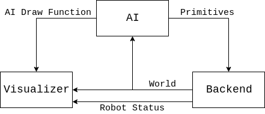

# Design Rationale

### TODO: Document These Things
* [ ] Namespaces
* [ ] Overall architecture
* [ ] Class Hierarchies
* [ ] Factory design pattern for Play, Primitive, etc.
* [ ] Singleton design pattern for Logger, Drawer, etc.
* [ ] Constants vs. Dynamic parameters (why we have both, where each should be used, etc.)
* [ ] Visualizer -> Ai interfaces (ROS messages, websockets, etc.)
* [ ] Difference between HL components and Navigator components. Be clear about where the separation is, and why. Actiona and Intents are not combined because Actions are part of HL, while Intents are part of Navigator. Combining them would break the abstraction and couple STP to the navigator, removing our flexibility to implement different HL systems in the future

# System Architecture
* [Glossary](#glossary)
* [Overview](#overview)
* [Backend](#backend)
* [AI](#ai)
* [Visualizer](#visualizer)
* [Diagram](#diagram)

## Glossary
A few commonly-used terms to be familiar with:
1. SSL-Vision
    * This is the shared vision system used by the Small Size League. It is what connects to the cameras above the field, does the vision processing, and transmits the positional data of everything on the field to our AI computers.
    * The GitHub repository can be found [here](https://github.com/RoboCup-SSL/ssl-vision)
2. SSL-Gamecontroller
    * Sometimes referred to as the "Refbox", this is another shared piece of Small Size League software that is used to send gamecontroller and referee commands to the teams. A human controls this application during the games to send the appropriate commands to the robots. For examples, some of these commands are what stage the gameplay is in, such as `HALT`, `STOP`, `READY`, or `PLAY`.
    * The GitHub repository can be found [here](https://github.com/RoboCup-SSL/ssl-game-controller)
3.  grSim
    * The general robot simulator used by the Small-Size-League. We use this to manually test strategy since it is easy to place the robots and ball in desired locations, run a strategy, and see what the robots do. It is not perfectly accurate, but is useful for testing high-level logic.
    * The GitHub repository can be found [here](https://github.com/RoboCup-SSL/grSim)
   

## Overview
At a high-level our system is made of 3 main components: The [Backend](#backend), the [AI](#ai), and the [Visualizer](#visualizer). These 3 components each run in their own thread, and communicate with each other using the [Observer design pattern](TODO use actual link).

## Backend
The `Backend` is responsible for all communication with the "outside world". It receives data over the network and also handles communication with the robots using our radio. The responsabilities of the `Backend` can be broken down into Input and Output.

### Input Responsabilities
1. Receiving robot status messages over the radio, and publishing this data to the rest of the system
2. Receiving camera data from SSL-Vision
2. Receiving referee commands from the Gamecontroller
3. Filtering the received vision and gamecontroller data
    * SSL-Vision only does vision processing, not filtering. This means that if there are several orange blobs on the field, SSL-Vision will send multiple locations for the ball. It is up to us to filter this data to determine the "correct" state of everything.
4. Storing the filtered data into the `World` datastructures understood by our system
5. Sending the filtered data to the rest of the system

### Output Responsabilities
1. Sending robot primitives to the robots

In practice, the `Backend` is just a simple interface that specifies `World` objects must be produced, and `Primitves` may be consumed. We have several implementations of the `Backend` to suite our needs. One imeplementation is used when we are controlling the physical robots, and need to use the radio. We have another implementation used to control the robots in grSim that uses the network rather than the radio to control the robots. The specifics of how this communication happens is hidden from the rest of the system making it very easy to switch backends depending on our needs.

## AI
The `AI` is where all of our gameplay logic takes place, and is the main "brain" of our system. It uses the information received by the [Backend](#backend) to make decisions, and sends `Primitives` back to the [Backend](#backend) for the robots to execute. Alltogether this feedback loop is what allows us to react to what's happening on the field and play soccer.

The `AI` is what implements things like strategy and navigation.

## Visualizer
The `Visualizer` is exactly what it sounds like: A visualizion of our [AI](#ai). It provides a GUI that shows us the state of the `World` as the [Backend](#backend) sees it, and is also able to display extra information that the [AI](#ai) would like to show. For example, it can show the planned paths of each friendly robot on the field, or highlight which enemy robots it thinks are a threat. Furthermore, it displays any warnings and status messages from the robots, such as if a robot is low on battery.

The `Visualizer` also lets us control the [AI](#ai) by setting `Parameters` (TODO: link here). Through the `Visualizer`, we can manually choose what strategy the [AI](#ai) should use, what team we think we are playing as, and tune more granular behavior such as how close an enemy must be to the ball before we consider them a threat.

## Diagram

