# Play and Tactic FSM Diagrams

## [PlaySelectionFSM](/src/software/ai/play_selection_fsm.h)

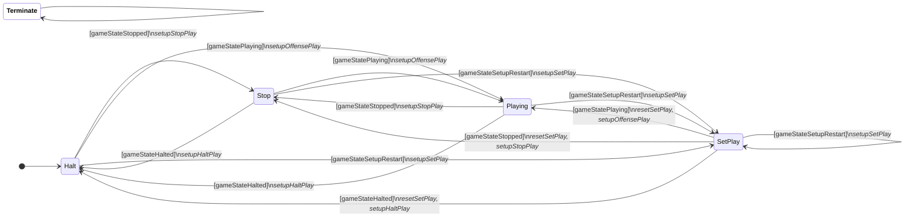

## [BallPlacementPlayFSM](/src/software/ai/hl/stp/play/ball_placement/ball_placement_play_fsm.h)

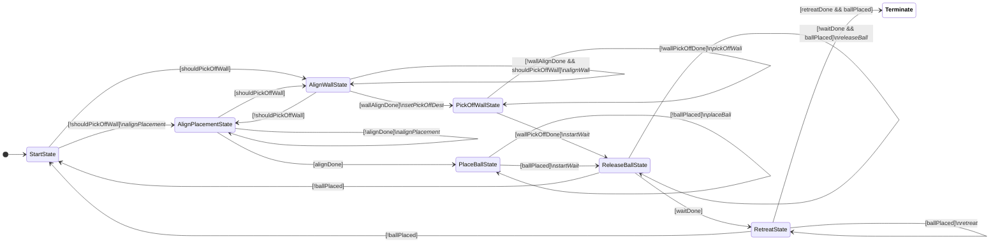

## [DefensePlayFSM](/src/software/ai/hl/stp/play/defense/defense_play_fsm.h)

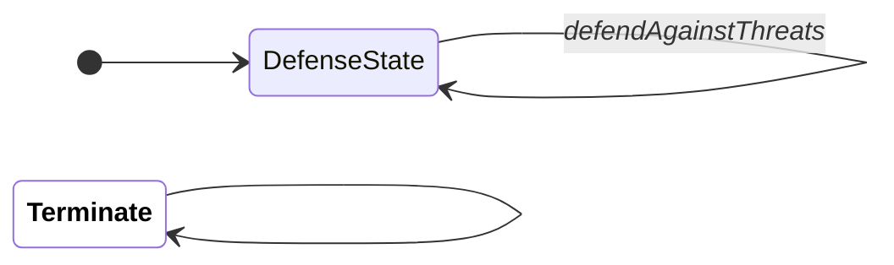

## [EnemyBallPlacementPlayFSM](/src/software/ai/hl/stp/play/enemy_ball_placement/enemy_ball_placement_play_fsm.h)

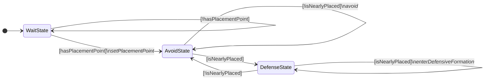

## [EnemyFreeKickPlayFSM](/src/software/ai/hl/stp/play/enemy_free_kick/enemy_free_kick_play_fsm.h)

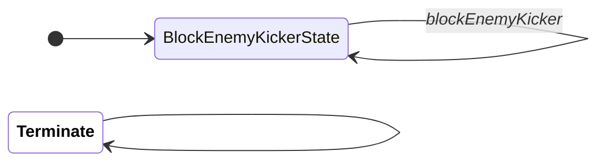

## [FreeKickPlayFSM](/src/software/ai/hl/stp/play/free_kick/free_kick_play_fsm.h)

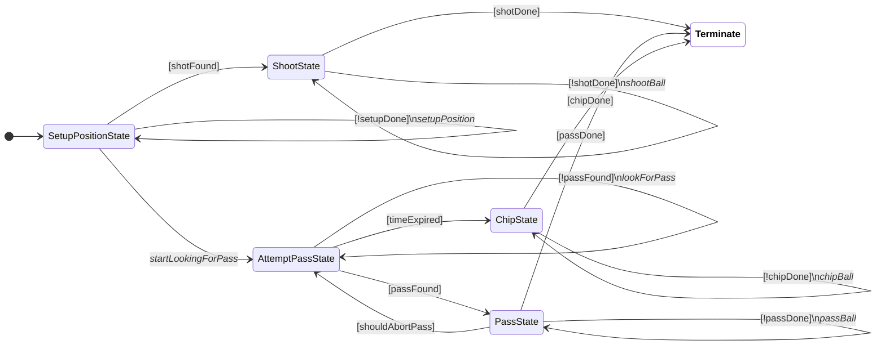

## [PenaltyKickPlayFSM](/src/software/ai/hl/stp/play/penalty_kick/penalty_kick_play_fsm.h)

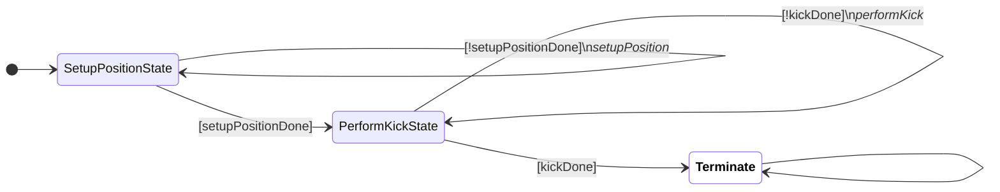

## [PenaltyKickEnemyPlayFSM](/src/software/ai/hl/stp/play/penalty_kick_enemy/penalty_kick_enemy_play_fsm.h)

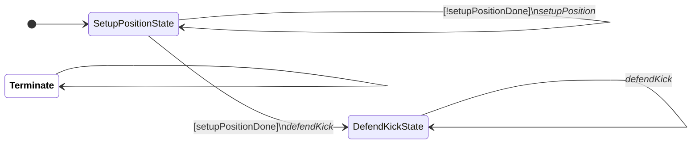

## [ChipSkillFSM](/src/software/ai/hl/stp/skill/chip/chip_skill_fsm.h)

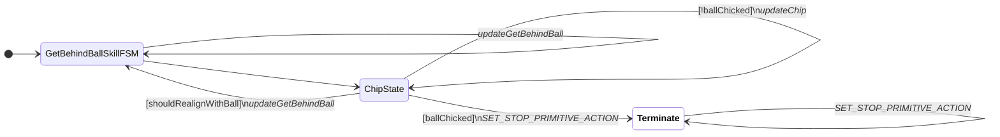

## [DribbleSkillFSM](/src/software/ai/hl/stp/skill/dribble/dribble_skill_fsm.h)

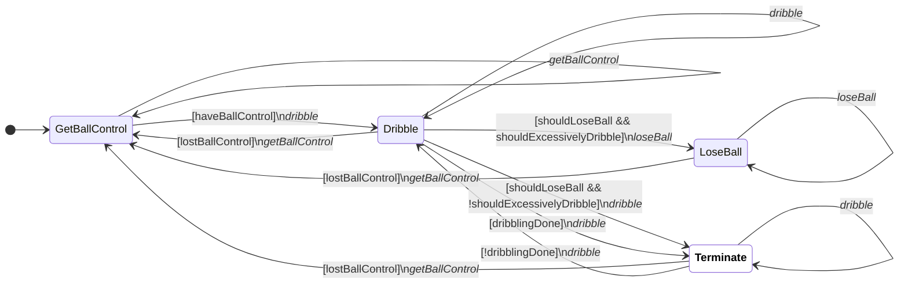

## [GetBehindBallSkillFSM](/src/software/ai/hl/stp/skill/get_behind_ball/get_behind_ball_skill_fsm.h)

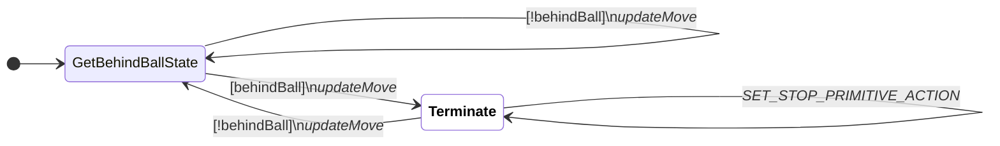

## [KeepAwaySkillFSM](/src/software/ai/hl/stp/skill/keep_away/keep_away_skill_fsm.h)

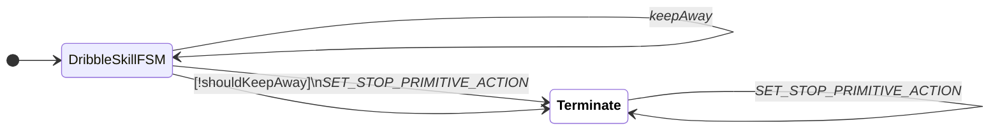

## [KickSkillFSM](/src/software/ai/hl/stp/skill/kick/kick_skill_fsm.h)


## [PassSkillFSM](/src/software/ai/hl/stp/skill/pass/pass_skill_fsm.h)

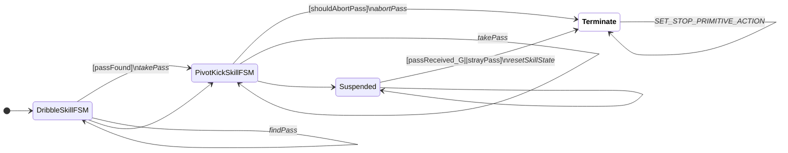

## [PivotKickSkillFSM](/src/software/ai/hl/stp/skill/pivot_kick/pivot_kick_skill_fsm.h)

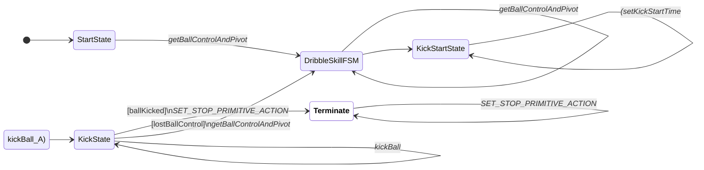

## [ShootSkillFSM](/src/software/ai/hl/stp/skill/shoot/shoot_skill_fsm.h)

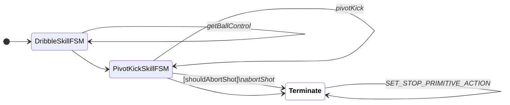

## [CreaseDefenderFSM](/src/software/ai/hl/stp/tactic/crease_defender/crease_defender_fsm.h)

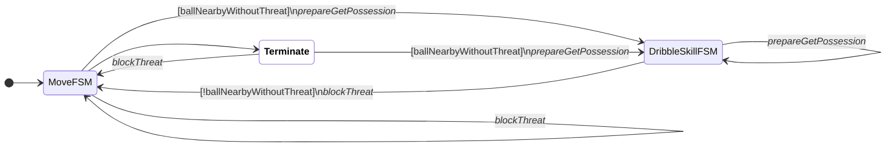

## [GoalieFSM](/src/software/ai/hl/stp/tactic/goalie/goalie_fsm.h)

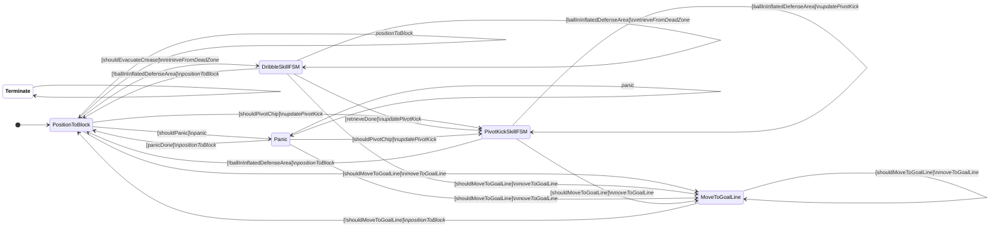

## [MoveFSM](/src/software/ai/hl/stp/tactic/move/move_fsm.h)

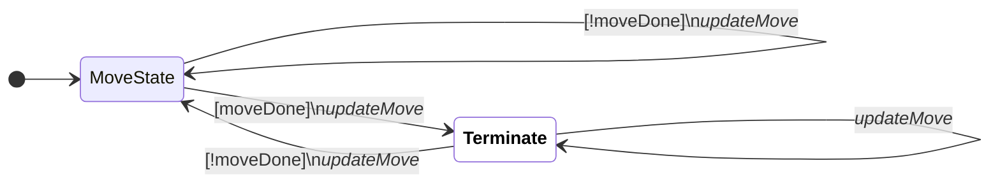

## [PassDefenderFSM](/src/software/ai/hl/stp/tactic/pass_defender/pass_defender_fsm.h)

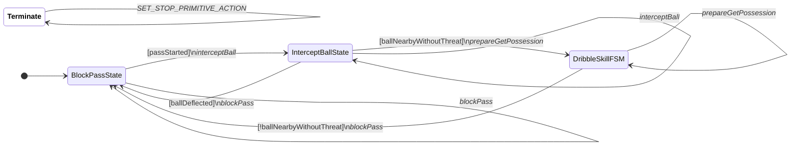

## [PenaltyKickFSM](/src/software/ai/hl/stp/tactic/penalty_kick/penalty_kick_fsm.h)

```mermaid

stateDiagram-v2
classDef terminate fill:white,color:black,font-weight:bold
direction LR
[*] --> DribbleSkillFSM
DribbleSkillFSM --> DribbleSkillFSM : [!takePenaltyShot]\n<i>updateApproachKeeper</i>
DribbleSkillFSM --> KickSkillFSM : [timeOutApproach]\n<i>shoot</i>
DribbleSkillFSM --> DribbleSkillFSM : <i>adjustOrientationForShot</i>
DribbleSkillFSM --> KickSkillFSM
KickSkillFSM --> KickSkillFSM : <i>shoot</i>
KickSkillFSM --> Terminate:::terminate
Terminate:::terminate --> Terminate:::terminate : <i>SET_STOP_PRIMITIVE_ACTION</i>

```

## [ReceiverFSM](/src/software/ai/hl/stp/tactic/receiver/receiver_fsm.h)

```mermaid

stateDiagram-v2
classDef terminate fill:white,color:black,font-weight:bold
direction LR
[*] --> WaitingForPassState
WaitingForPassState --> WaitingForPassState : [!passStarted]\n<i>updateReceive</i>
WaitingForPassState --> OneTouchShotState : [passStarted && onetouchPossible]\n<i>updateOnetouch</i>
WaitingForPassState --> ReceiveAndDribbleState : [passStarted && !onetouchPossible]\n<i>updateReceive</i>
ReceiveAndDribbleState --> WaitingForPassState : [passReceivedByTeammate]\n<i>updateReceive</i>
ReceiveAndDribbleState --> DribbleSkillFSM : [strayPass_G||slowPass]\n<i>retrieveBall</i>
ReceiveAndDribbleState --> ReceiveAndDribbleState : <i>adjustReceive</i>
DribbleSkillFSM --> WaitingForPassState : [passReceivedByTeammate]\n<i>updateReceive</i>
DribbleSkillFSM --> DribbleSkillFSM : <i>retrieveBall</i>
OneTouchShotState --> OneTouchShotState : [!passReceived && !strayPass]\n<i>updateOnetouch</i>
OneTouchShotState --> ReceiveAndDribbleState : [!passReceived && strayPass]\n<i>adjustReceive</i>
OneTouchShotState --> WaitingForPassState : [passReceived]\n<i>updateOnetouch</i>
Terminate:::terminate --> Terminate:::terminate : <i>SET_STOP_PRIMITIVE_ACTION</i>

```

## [ShadowEnemyFSM](/src/software/ai/hl/stp/tactic/shadow_enemy/shadow_enemy_fsm.h)

```mermaid

stateDiagram-v2
classDef terminate fill:white,color:black,font-weight:bold
direction LR
[*] --> MoveFSM
MoveFSM --> BlockPassState : [!enemyThreatHasBall]\n<i>blockPass</i>
MoveFSM --> MoveFSM : <i>blockShot</i>
MoveFSM --> StealAndChipState
BlockPassState --> BlockPassState : [!enemyThreatHasBall]\n<i>blockPass</i>
BlockPassState --> MoveFSM : [enemyThreatHasBall]\n<i>blockShot</i>
StealAndChipState --> StealAndChipState : [enemyThreatHasBall]\n<i>stealAndChip</i>
StealAndChipState --> Terminate:::terminate : [!enemyThreatHasBall]\n<i>blockPass</i>
Terminate:::terminate --> BlockPassState : [!enemyThreatHasBall]\n<i>blockPass</i>
Terminate:::terminate --> MoveFSM : [enemyThreatHasBall]\n<i>blockShot</i>
Terminate:::terminate --> Terminate:::terminate : <i>SET_STOP_PRIMITIVE_ACTION</i>

```

## [StopFSM](/src/software/ai/hl/stp/tactic/stop/stop_fsm.h)

```mermaid

stateDiagram-v2
classDef terminate fill:white,color:black,font-weight:bold
direction LR
[*] --> StopState
StopState --> StopState : [!stopDone]\n<i>updateStop</i>
StopState --> Terminate:::terminate : [stopDone]\n<i>updateStop</i>
Terminate:::terminate --> StopState : [!stopDone]\n<i>updateStop</i>
Terminate:::terminate --> Terminate:::terminate : [stopDone]\n<i>updateStop</i>

```

