# Play and Tactic FSM Diagrams

## [PlaySelectionFSM](/src/software/ai/play_selection_fsm.h)

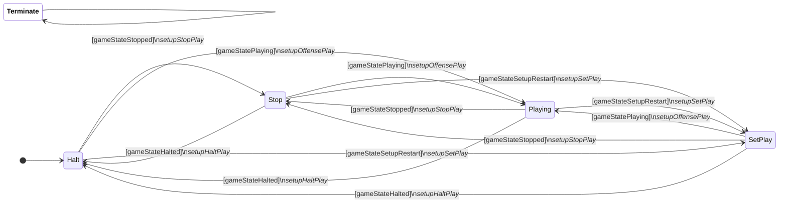

## [BallPlacementPlayFSM](/src/software/ai/hl/stp/play/ball_placement/ball_placement_play_fsm.h)

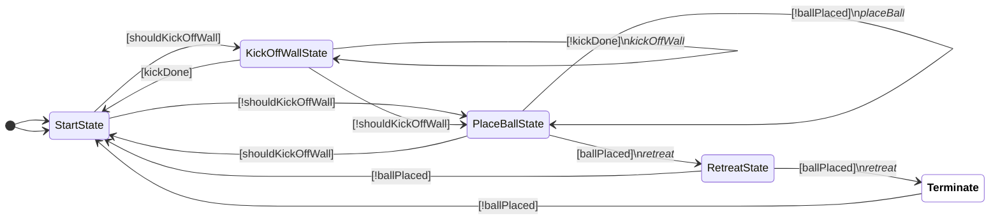

## [CreaseDefensePlayFSM](/src/software/ai/hl/stp/play/crease_defense/crease_defense_play_fsm.h)

## [PenaltyKickPlayFSM](/src/software/ai/hl/stp/play/penalty_kick/penalty_kick_play_fsm.h)

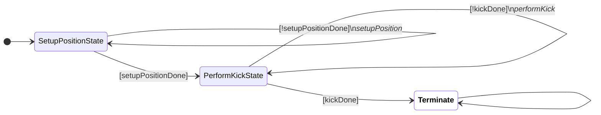

## [ShootOrPassPlayFSM](/src/software/ai/hl/stp/play/shoot_or_pass/shoot_or_pass_play_fsm.h)

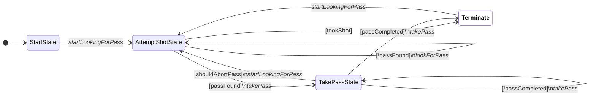

## [AttackerFSM](/src/software/ai/hl/stp/tactic/attacker/attacker_fsm.h)

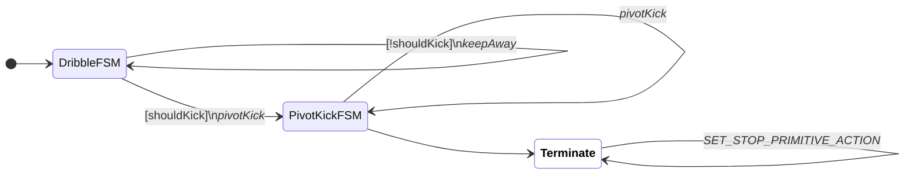

## [ChipFSM](/src/software/ai/hl/stp/tactic/chip/chip_fsm.h)

## [CreaseDefenderFSM](/src/software/ai/hl/stp/tactic/crease_defender/crease_defender_fsm.h)

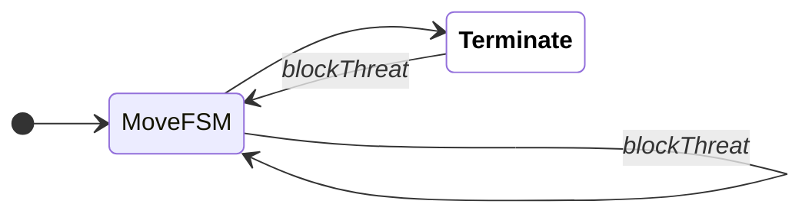

## [DribbleFSM](/src/software/ai/hl/stp/tactic/dribble/dribble_fsm.h)

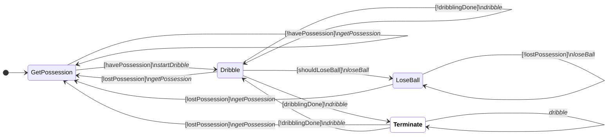

## [GetBehindBallFSM](/src/software/ai/hl/stp/tactic/get_behind_ball/get_behind_ball_fsm.h)

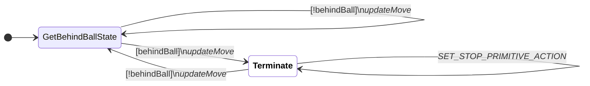

## [GoalieFSM](/src/software/ai/hl/stp/tactic/goalie/goalie_fsm.h)

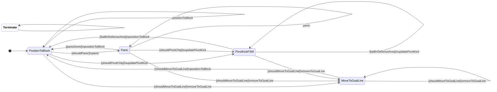

## [KickFSM](/src/software/ai/hl/stp/tactic/kick/kick_fsm.h)

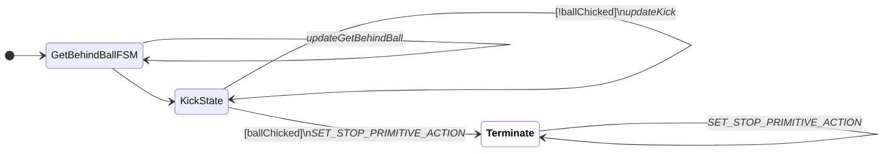

## [MoveFSM](/src/software/ai/hl/stp/tactic/move/move_fsm.h)

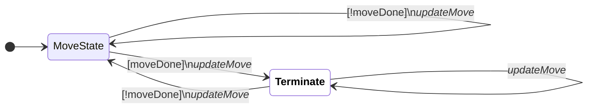

## [PassDefenderFSM](/src/software/ai/hl/stp/tactic/pass_defender/pass_defender_fsm.h)

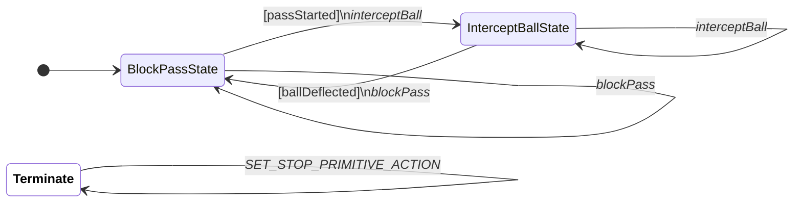

## [PenaltyKickFSM](/src/software/ai/hl/stp/tactic/penalty_kick/penalty_kick_fsm.h)

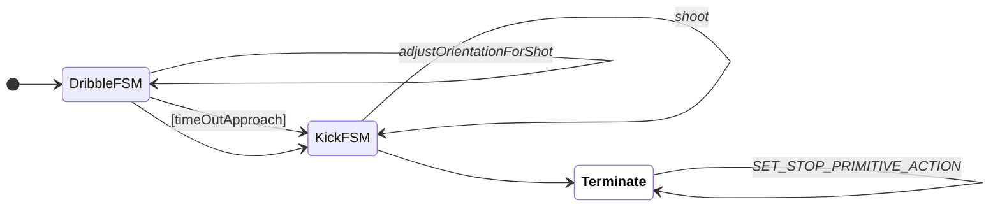

## [PivotKickFSM](/src/software/ai/hl/stp/tactic/pivot_kick/pivot_kick_fsm.h)

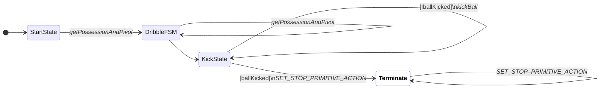

## [ReceiverFSM](/src/software/ai/hl/stp/tactic/receiver/receiver_fsm.h)

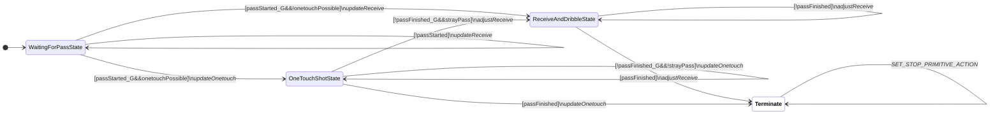

## [ShadowEnemyFSM](/src/software/ai/hl/stp/tactic/shadow_enemy/shadow_enemy_fsm.h)

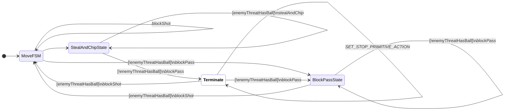

## [StopFSM](/src/software/ai/hl/stp/tactic/stop/stop_fsm.h)

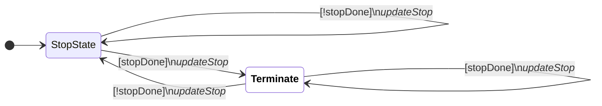

