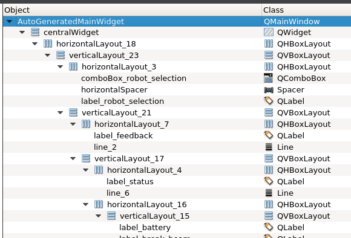
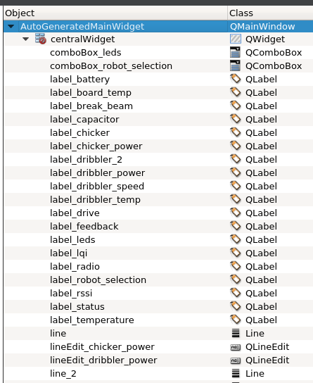

# Qt Best Practices
Although this will focus on Qt-specific examples, these principles generally apply to all GUI design and implementation. They are really just Software Engineering principles applied to GUIs.

## Build A Hierarchy
Qt is designed to handle hierarchy. It has [an extensive and robust system for maintaining Object Trees and parent/child relationships between components](https://doc.qt.io/qt-5/objecttrees.html). Much like regular code, GUIs should be created in a logical hierarchy to make organization and re-use easier.

Make sure to use layouts, and group widgets in a logical way. For example, several widgets that work together to collect a user's mailing address should be grouped. This group may then be part of a larger group of widgets in a popup dialog asking for billing information.

Here is a good example of laying out widgets in a hierarchy:

Avoid laying out all your widgets in a single layer like this:

The main point to remember is to use [layouts](https://doc.qt.io/qt-5/layout.html) to group and manage widgets, and to create these groups in a logical way that can be built into a hierarchy. This will make it significantly easier to replace parts of the GUI later, or move components around.

## Create Reusable Widgets
Much like how we create functions in order to reuse code, [widgets](https://doc.qt.io/qt-5/qtwidgets-index.html) should be created so that they are reusable.

For example, if you create a few widgets that work together to gather user input with a slider and display the current value next to it, you should combine all of this into its own `SliderWithValue` widget. This will make it very easy to make several copies of this widget, or use it somewhere else in a completely different application. Similarly, if you need specialized functionality from any widget (for example, our `ZoomableQGraphicsView`), this should also be implemented as a custom reusable widget.

Creating widgets that are slightly more generic and reusable are very useful and allow code and graphical modules to be shared and reused between multiple applications.

## Miscellaneous Qt Tips
* Define minimum and maximum sizes (if it makes sense) to help enforce the correct sizing of elements
    * e.g. Define a minimum width for a textbox based on what it's expected to contain
