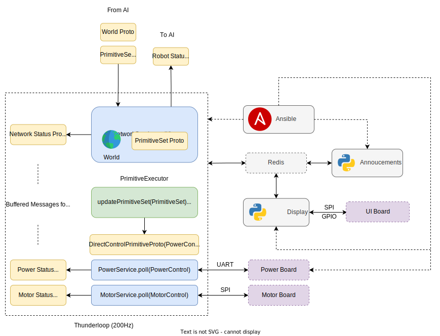

# Robot Software Architecture

# Table of Contents
* [Tools](#tools)
   * [Ansible](#ansible)
   * [Systemd](#systemd)
   * [Redis](#redis)
* [Redis](#redis)
* [Thunderloop](#thunderloop)
* [Announcements](#announcements)
* [Display](#display)

# Tools

## Ansible

[Ansible](https://www.ansible.com/overview/how-ansible-works) allows us to run actions on multiple robots at once. Actions are communicated through YAML files called playbooks. Playbooks contain a series of tasks (ex move a file, run this script, output this command) and logic dictating dependencies between tasks. When playbooks are run, Ansible establishes an SSH connection between the user's computer and target Jetson Nanos, allowing it to run the tasks in the playbook. Output from each task, and any other requested output, is displayed on the console

For a more detailed look at how Ansible works, [see the RFC](https://docs.google.com/document/d/1hN3Us2Vjr8z6ihqUVp_3L7rrjKc-EZ-l2hZJc31gNOc/edit)

Example command: `bazel run //software/jetson_nano/ansible:run_ansible --cpu=jetson_nano -- --playbook deploy_nano.yml --hosts <robot_ip> --ssh_pass <jetson_nano_password>`

More commands available [here](useful-robot-commands.md#off-robot-commands)

## Systemd

[Systemd](https://www.freedesktop.org/wiki/Software/systemd/) allows us to have services which start as soon as we boot the robot, will automatically restart and are individually controllable. All services have the file {service}.service, which controls the configuration of that service. Currently we have a service for thunderloop, announcements and display

To learn more about how it works, [see the RFC](https://docs.google.com/document/d/1hN3Us2Vjr8z6ihqUVp_3L7rrjKc-EZ-l2hZJc31gNOc/edit)

## Redis

[Redis](https://redis.io/docs/about/) is an in-memory key-value store. This allows us to share state between processes as well as modify values dynamically through the provided [cli](useful-robot-commands#redis). Values also persists between boots.

# Thunderloop

Thunderloop is software that runs in a loop. It continuously polls services (unrelated from Systemd) sending relevant control proto (`PowerControl`, `MotorControl`) and receiving back status proto. Currently we have a [Network](https://github.com/UBC-Thunderbots/Software/blob/master/src/software/jetson_nano/services/network.cpp), [Power](https://github.com/UBC-Thunderbots/Software/blob/master/src/software/jetson_nano/services/power.cpp) and [Motor service](https://github.com/UBC-Thunderbots/Software/blob/master/src/software/jetson_nano/services/motor.cpp). Thunderloop also receives `World` and `PrimitiveSet` Proto from AI and sends back Robot Status.

Motor and Power service both interface with their respective electrical boards over different communication interfaces, namely SPI and UART respectively.

# Announcements
 
Broadcasts packets for what robot IDs are connected to wifi and what IPs they have. Combined with `robot_broadcast_receiver.py` allows us to see all robots on the network.

# Display

Displays information about the robot for us. Uses redis to receive info from other processes. Can also change values with physical buttons.
