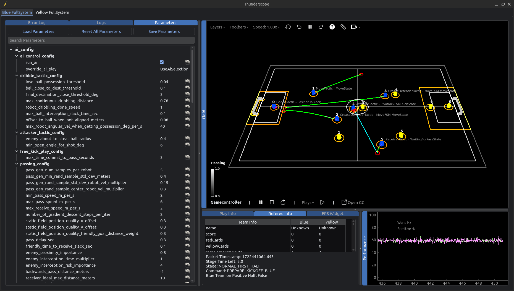

# Architecture and Design Rationales

# Table of Contents

<!--TOC-->

- [Table of Contents](#table-of-contents)
- [Architecture Overview](#architecture-overview)
  - [League-Maintained Software](#league-maintained-software)
    - [SSL Vision](#ssl-vision)
    - [SSL Gamecontroller](#ssl-gamecontroller)
- [Protobuf](#protobuf)
  - [Important Protobuf Messages](#important-protobuf-messages)
    - [Primitives](#primitives)
    - [Robot Status](#robot-status)
- [Conventions](#conventions)
  - [Coordinates](#coordinates)
  - [Angles](#angles)
  - [Convention Diagram](#convention-diagram)
- [Fullsystem](#fullsystem)
  - [Backend](#backend)
    - [Backend Diagram](#backend-diagram)
  - [Sensor Fusion](#sensor-fusion)
    - [World](#world)
      - [Team](#team)
      - [Robot](#robot)
      - [Ball](#ball)
      - [Field](#field)
      - [Game State](#game-state)
    - [Filters](#filters)
- [AI](#ai)
  - [Strategy](#strategy)
    - [STP Diagram](#stp-diagram)
    - [Skills](#skills)
    - [Tactics](#tactics)
      - [Tactic Assignment](#tactic-assignment)
      - [Hierarchical Tactic FSMs](#hierarchical-tactic-fsms)
      - [Control Parameters](#control-parameters)
    - [Plays](#plays)
  - [Finite State Machines](#finite-state-machines)
    - [What Are Finite State Machines?](#what-are-finite-state-machines)
    - [Boost-ext SML Library](#boost-ext-sml-library)
    - [How Do We Use SML?](#how-do-we-use-sml)
    - [SML Best Practices](#sml-best-practices)
  - [Coroutines](#coroutines)
    - [What Are Coroutines?](#what-are-coroutines)
    - [What Coroutines Do We Use?](#what-coroutines-do-we-use)
    - [How Do We Use Coroutines?](#how-do-we-use-coroutines)
    - [Coroutine Best Practices](#coroutine-best-practices)
  - [Motion Planning](#motion-planning)
    - [Trajectory Planner](#trajectory-planner)
    - [Trajectory Generation and Obstacle Avoidance](#trajectory-generation-and-obstacle-avoidance)
- [Thunderscope](#thunderscope)
  - [Thunderscope GUI](#thunderscope-gui)
    - [3D Visualizer](#3d-visualizer)
      - [Layers](#layers)
  - [Inter-Process Communication](#inter-process-communication)
  - [Proto Log Replay](#proto-log-replay)
  - [Dynamic Parameters](#dynamic-parameters)
- [Simulator](#simulator)
  - [Simulated Tests](#simulated-tests)
    - [Simulated Tests Architecture](#simulated-tests-architecture)
      - [Validation Functions](#validation-functions)
    - [Component Connections and Determinism](#component-connections-and-determinism)
    - [Simulated Tests Diagram](#simulated-tests-diagram)
- [E-Stop](#e-stop)
- [Design Patterns](#design-patterns)
  - [Abstract Classes and Inheritance](#abstract-classes-and-inheritance)
  - [Singleton Pattern](#singleton-pattern)
  - [Factory Pattern](#factory-pattern)
  - [Visitor Pattern](#visitor-pattern)
  - [Observer Pattern](#observer-pattern)
    - [Threaded Observer](#threaded-observer)
  - [Publisher-Subscriber Pattern](#publisher-subscriber-pattern)
  - [C++ Templating](#c-templating)

<!--TOC-->

# Architecture Overview


At a high-level, our system is split into several independent processes that [communicate with each other](#inter-process-communication). Our architecture is designed in this manner to promote decoupling of different features, making our software easier to expand, maintain, and test.

- [**Fullsystem**](#fullsystem) is the program that processes data and makes decisions for a [team](#team) of [robots](#robot). It manages [**Sensor Fusion**](#sensor-fusion), which is responsible for processing and filtering raw data, and the [**AI**](#ai) that makes gameplay decisions.

- [**Thunderscope**](#thunderscope) is an application that provides a GUI for visualizing and interacting with our software.

- The [**Simulator**](#simulator) provides a physics simulation of the world (robots, ball, and field), enabling testing of our gameplay when we don't have access to a real field. This process is optional and used only for development and testing purposes; in a real match, our system will receive data from [SSL-Vision](#ssl-vision).

- [**Thunderloop**](/docs/robot-software-architecture.md#thunderloop) is the software that runs onboard our robots. It is responsible for coordinating communication between our [AI](#ai) computer and the motor and power boards in our robots. It is part our robot software architecture, which is documented [here](/docs/robot-software-architecture.md).

## League-Maintained Software

Our software is designed to interact with the following software developed and maintained by the RoboCup Small Size League:

### SSL Vision
* This is the shared vision system used by the Small Size League. It is what connects to the cameras above the field, does the vision processing, and transmits the positional data of everything on the field to our [AI](#ai) computers.
* The GitHub repository can be found [here](https://github.com/RoboCup-SSL/ssl-vision)

### SSL Gamecontroller
* Sometimes referred to as the "Referee", this is another shared piece of Small Size League software that is used to send gamecontroller and referee commands to the teams. A human and/or [computer auto-referee](#https://ssl.robocup.org/league-software/#auto-referees) controls this application during the games to send the appropriate commands to the robots. For example, some of these commands are what stage the gameplay is in, such as `HALT`, `STOP`, `READY`, or `PLAY`.
* The GitHub repository can be found [here](https://github.com/RoboCup-SSL/ssl-game-controller)

# Protobuf
[Protobufs or protocol buffers](https://protobuf.dev/) are used to pass messages between components in our system.
After building using Bazel, the `.proto` files are generated into `.pb.h` and `.pb.cc` files, which are found in `bazel-out/k8-fastbuild/bin/proto`.
To include these files in our code, we simply include `proto/<protobuf_filename>.pb.h`.

## Important Protobuf Messages
These are [protobuf](https://developers.google.com/protocol-buffers/docs/cpptutorial) messages that we define and that are important for understanding how the [AI](#ai) works.

### Primitives

**Primitives** represent the low-level actions that a robot can execute. They are sent to the robots and can be "blindly" executed without knowledge of the [World](#world) and/or the high-level gameplay [strategy](#strategy). Primitives are understood directly by our robot software, which will translate the primitive into motor and power board inputs to make the robot move, dribble, kick, and/or chip as instructed.

Each Primitive is a C++ class that generates an associated `TbotsProto::Primitive` protobuf message that can be sent to the robots.

Primitives act as the abstraction between our [AI](#ai) and our robot software. It splits the responsibility such that the [AI](#ai) is responsible for sending a Primitive to a robot telling it what it wants it to do, and the robot is responsible for making sure it does what it's told.

### Robot Status
The `TbotsProto::RobotStatus` protobuf message contains information about the status of a single robot. Examples of the information they include are:
* Robot battery voltage
* Whether or not the robot senses the ball in the breakbeam
* The capacitor charge on the robot
* The temperature of the dribbler motor

Information about the robot status is communicated and stored as `RobotStatus` protobuf messages. [Thunderscope](#thunderscope) displays warnings from incoming `RobotStatus` messages so we can take appropriate action. For example, during a game we may get a "low battery warning" for a certain robot, so we know to substitute it and replace the battery before it dies on the field.


# Conventions

Below documents various conventions we use and follow in our software.

## Coordinates
We use a slightly custom coordinate convention to make it easier to write our code in a consistent and understandable way. This is particularly important for any code handling gameplay logic and positions on the field.

The coordinate system is a simple 2D x-y plane. The x-dimension runs between the friendly and enemy goals, along the longer dimension of the field. The y-dimension runs perpendicular to the x-dimension, along the short dimension of the field.

Because we have to be able to play on either side of a field during a game, this means the "friendly half of the field" will not always be in the positive or negative x part of the coordinate plane. This inconsistency is a problem when we want to specify points like "the friendly net", or "the enemy corner". We can't simple say the friendly net is `(-4.5, 0)` all the time, because this would not be the case if we were defending the other side of the field where the friendly net would be `(4.5, 0)`.

In order to overcome this, our convention is that:
* The **friendly half** of the field is **always negative x**, and the **enemy half** of the field is **always positive x**
* `y` is positive to the "left" of someone looking at the enemy goal from the friendly goal
* The center of the field (inside the center-circle) is the origin / `(0, 0)`

This is easiest to understand in the [diagram](#convention-diagram) below.

Based on what side we are defending, [Sensor Fusion](#sensor-fusion) will transform all the coordinates of incoming data so that it will match our convention. This means that from the perspective of the rest of the system, the friendly half of the field is always negative x and the enemy half is always positive x. Now when we want to tell a robot to move to the friendly goal, we can simply tell it so move to `(-4.5, 0)` and we know this will _always_ be the friendly side. All of our code is written with the assumption in mind.

## Angles
Going along with our coordinate convention, we have a convention for angles as well. An Angle of `0` is along the positive x-axis (facing the enemy goal), and positive rotation is counter-clockwise (from a perspective above the field, looking at it like a regular x-y plane where +y is "up"). See the [diagram](#convention-diagram) below.

Because of our [Coordinate Conventions](#coordinates), this means that an angle of `0` will always face the enemy net regardless of which side of the field we are actually defending.

## Convention Diagram


# Fullsystem

**Fullsystem** processes data and makes decisions for a [team](#team) of [robots](#robot). It manages [Sensor Fusion](#sensor-fusion), which is responsible for processing and filtering raw data, and the [AI](#ai) that makes gameplay decisions. 

Data within Fullsystem is shared between components using the [observer pattern](#observer-pattern); for instance, [Sensor Fusion](#sensor-fusion) and the [Backend](#backend) are `Subject`s that the [AI](#ai) observes.

## Backend
Fullsystem contains a `Backend` responsible for all communication with the "outside world". The responsibilities of the `Backend` can be broken down into communication using `SensorProto` and [Primitives](#primitives) messages:

* Upon receiving the following messages from the network, the `Backend` will store it in a `SensorProto` message and send it to [Sensor Fusion](sensor-fusion):
  * Robot status messages
  * Vision data about where the robots and ball are (typically from [SSL-Vision](#ssl-vision))
  * Referee commands (typically from the [SSL-Gamecontroller](#ssl-gamecontroller)

* Upon receiving [Primitives](#primitives) from the [AI](#ai), `Backend` will send the primitives to the robots or the [Simulator](#simulator).

The `Backend` was designed to be a simple interface that handles all communication with the "outside world", allowing for different implementations that can be swapped out in order to communicate with different hardware/ protocols/programs.

#### Backend Diagram


## Sensor Fusion
`Sensor Fusion` is responsible for processing the raw data contained in SensorProto into a coherent snapshot of the [World](#world) that the [AI](#ai) can use. It invokes filters to update components of [World](#world), and then combines the components to send out the most up-to-date version.

### World
The `World` class is what we use to represent the state of the world at any given time. In this context, the world includes the positions and orientations of all robots on the field, the position and velocity of the ball, the dimensions of the field being played on, and the current referee commands. Altogether, it's the information we have at any given time that we can use to make decisions.

A `World` is composed of the following classes:

#### Team
A `Team` class represents a collection of [Robots](#robot). 

#### Robot
A `Robot` class represents the state of a single robot on the field. This includes its position, orientation, velocity, angular velocity, and any other information about its current state.

#### Ball
The `Ball` class represents the state of the ball. This includes its position and velocity, and any other information about its current state.

#### Field
The `Field` class represents the state of the physical field being played on, which is primarily its physical dimensions. The `Field` class provides many functions that make it easy to get points of interest on the field, such as the enemy net, friendly corner, or center circle. Also see the [coordinate convention](#coordinates) we use for the field (and all things on it).

#### Game State
The `GameState` class represents the current state of the game as dictated by the Gamecontroller. These provide functions like `isPlaying()`, `isHalted()` which tell the rest of the system what game state we are in, and make decisions accordingly. We need to obey the rules!

### Filters
Filters take the raw data from SensorProto and returns an updated version of a component of the [World](#world). For example, the `BallFilter` takes `BallDetection`s and returns an updated `Ball`.

> **Why we need to do this:** Programs that provide data like [SSL-Vision](#ssl-vision) only provide raw data. This means that if there are several orange blobs on the field, [SSL-Vision](#ssl-vision) will tell us the ball is in several different locations. It is up to us to filter this data to determine the "correct" position of the ball. The same idea applies to robot positions and other data we receive.

Filters provide a flexible way to modularize the processing of raw data, making it easy to update filters and add new ones. Filters are sometimes stateful. For example, the `BallFilter` "remembers" previous locations of the ball in order to estimate the ball's current velocity.


# AI
The **AI** is the part of the [Fullsystem](#fullsystem) where all of our gameplay logic takes place, and it is the main "brain" of our system. It uses the information received from [Sensor Fusion](#sensor-fusion) to make decisions, and then sends [Primitives](#primitives) to the [Backend](#backend) for the robots to execute. Altogether, this feedback loop is what allows us to react to what's happening on the field and play soccer in real-time.

The two main components of the AI are [strategy](#strategy) and [motion planning](#motion-planning).

## Strategy
We use a framework called **STP (Skills, Tactics, Plays)** to organize and implement our gameplay strategy. The STP framework was originally proposed by Carnegie Mellon University back in 2004. The original paper can be found [here](https://kilthub.cmu.edu/articles/STP_Skills_Tactics_and_Plays_for_Multi-Robot_Control_in_Adversarial_Environments/6561002/1).

STP is a way of breaking down roles and responsibilities into a simple hierarchy, making it easier to build up more complex strategies from simpler pieces. This is the core of where our strategy is implemented.

###  STP Diagram
The STP diagram shows how this works. Functions to assign tactics to robots and build motion constraints are passed into a `Play`'s `get` function, which the `Play` uses to generate tactics with assigned robots and with updated motion constraints.


### Skills
The S in STP stands for **Skills**. A Skill represents a lower-level behaviour that a robot can execute. Examples include:

- Moving to a position (without colliding with anything)
- Shooting the ball at a target
- Chipping the ball towards a target

When we refer to Skills in our AI, we typically are talking about [Primitives](#primitives), which are messages representing low-level actions that can be sent to and interpreted by our robots directly. We may also sometimes use the term Skill to describe simpler, skill-like [Tactics](#tactics) that other Tactics are composed from (see [Hierarchical Tactic FSMs](#hierarchical-tactic-fsms)).

### Tactics
The T in STP stands for **Tactics**. A Tactic represents a single robot's role on a team. Examples include:

- Being a goalie
- Being an attacker
- Being a pass receiver
- Being a defender that shadows enemy robots
- Being a defender that tries to steal the ball from enemies

Tactics return [Primitives](#primitives) describing the low-level actions the robot should take as the Tactic. Every Tactic has an associated Tactic FSM (see [Finite State Machines](#finite-state-machines)) that it uses to decide what Primitive to execute based on the state of the game; the FSM is updated with the current [World](#world) and returns a Primitive to execute.

#### Tactic Assignment

A Tactic by itself is not directly assigned to any single robot. Instead, `Tactic::get` returns a map associating each and every friendly robot with the [Primitive](#primitives) they would execute *if* that robot was assigned that Tactic. We then say that every Primitive has some *cost* quantifying how easy it is for the robot to perform the action. For example, a `MovePrimitive` may incur a larger cost depending on the distance between the robot and the `MovePrimitive`'s target position, reason being that it is in some sense "harder" for a robot to reach a faraway target successfully. With all this information, the [Play](#plays) assigns one robot to every Tactic based on the Primitives that would be executed, in such a way that the *total cost* incurred is minimized; this is a form of the classic [assignment problem](https://en.wikipedia.org/wiki/Assignment_problem) which we solve using the [Hungarian algorithm](https://en.wikipedia.org/wiki/Hungarian_algorithm).

In order to produce the map returned by `Tactic::get`, every Tactic must have one Tactic FSM for every robot. Each FSM tracks the state of the Tactic for one robot and produces the Primitive that the robot would execute.

#### Hierarchical Tactic FSMs

Tactics FSMs may make use of other simpler Tactic FSMs that implement common behaviours. These simpler Tactics can be thought of as [Skills](#skills) since they do not represent any strategic role, but instead execute a well-defined action. For example:

- `MoveTactic` simply returns a `MovePrimitive` constructed using the `MoveTactic`'s [control parameters](#control-parameters) (which match `MovePrimitive`'s constructor parameters).
- `PivotKickTactic` approaches the ball, pivots around the ball to face towards a specified target, and then kicks the ball in that direction.

The FSMs of these simpler Tactics are used as "sub-FSMs" and are treated as a state in more complex Tactic FSMs (read about [hierarchical FSMs in the FSM section](#what-are-finite-state-machines)). When a Tactic FSM is in one of its sub-FSM states, it should update the sub-FSM with the [World](#world) and return the Primitive returned by the sub-FSM. This means that the Tactic FSM will effectively "run" the sub-FSM and do its bidding while in the sub-FSM state, and it will leave the state once the sub-FSM terminates (e.g. `MoveTacticFSM` terminates once the robot has successfully reached the target destination).

This pattern promotes code reuse, allowing us to compose complex Tactic FSMs from smaller, skill-like Tactic FSMs that can be reused in different contexts.

#### Control Parameters

Every Tactic defines its own custom `ControlParams` struct representing the specific settings and parameters we can set to influence the Tactic's behavior. At every timestep, alongside the current [World](#world), we update the Tactic's FSM with `ControlParams` carrying information about what want we want the Tactic to do (e.g. defend against a certain enemy robot). Tactics making use of other Tactics ([as sub-FSMs](#hierarchical-tactic-fsms)) can use control parameters to control the behaviour of the sub-FSM, and [Plays](#plays) can set each of its Tactics' control params to coordinate responsibilities (e.g. tell each defensive Tactic to defend against a different enemy robot)

### Plays

The P in STP stands for **Plays**. A Play represents a "team-wide goal" for the robots. They can be thought of much like plays in real-life soccer. Examples include:

- A play for taking friendly free kicks
- A play for defending enemy kickoffs
- A general defense play
- A passing-based offense play
- A dribbling-based offense play

Plays are made up of [Tactics](#tactics). A Play chooses which Tactics it wants to assign based on the state of the game. This logic is implemented in an associated Play FSM (see [Finite State Machines](#finite-state-machines)) that gets updated with the current [World](#world) and returns a list of Tactics to assign. The Play then attempts to assign robots to these desired Tactics in an optimal manner (see [Tactic Assignment](#tactic-assignment)).

Plays return `PrimitiveSet`s that map each robot to the [Primitive](#primitives) they should execute. These Primitives are produced by the [Tactics](#tactics) assigned by the Play to each robot.

The AI chooses which Play to run using `PlaySelectionFSM`. `PlaySelectionFSM` is updated with the current World and returns the Play to run based on the current game state.

## Finite State Machines

### What Are Finite State Machines?
A finite state machine (FSM) is a system with a finite number of states with defined transitions and outputs based on the inputs to the system. A FSM is in exactly one of its states at any time, and it can change (transition) from its current state to another in response to some input. In particular, we are interested in defining _when_ a FSM should transition to another state (_guards_) and _what_ should happen when transitions occur (_actions_), given a specific input (_event_).

Hierarchical state machines are state machines that are composed of one or more FSMs, which we call sub-FSMs. The parent FSM can treat a sub-FSM as a state with _guards_ and _actions_ when transitioning to and from the sub-FSM. When the sub-FSM enters a terminal state, the parent FSM is able to automatically transition to another state.


[source](https://www.block-net.de/Programmierung/cpp/fsm/fsm.html)

### Boost-ext SML Library
We use [Boost-ext SML](https://github.com/boost-ext/sml), short for State Machine Library, to create our finite state machines. This library defines state machines through a transition table, where a row indicates the transition from one state to another state using _guards_, _actions_ and _events_. The syntax of a row of the transition table looks like this:
```
src_state + event [guard] / action = dest_state
```
where the `src_state` transitions to the `dest_state`, while performing the `action`, only if the `event` is received and the `guard` is true. _Events_ are structs of new information that FSMs receive, and _guards_ and _actions_ are functions that take events as arguments. _Guards_ must return a boolean and _actions_ must return void. An asterix (\*) at the start of a row indicates that the state is an initial state. The rows of the transition table are processed in order from top to bottom and the first row to match is executed.

The library also supports hierarchical FSMs. Sub-FSMs are treated as states where an unconditional transition occurs when the sub-FSM is in the terminal state, `X`.
```c++
const auto SubFSM_S = boost::sml::state<SubFSM>;

// ...in the transition table...
SubFSM_S = next_state // Transitions to next_state only when the SubFSM is in the terminal state, X
```
In order to update a sub-FSM with an event, we need to do the following:
```c++
const auto update_sub_fsm_action =
    [](auto event, boost::sml::back::process<TypeOfSubFSMEvent> processEvent) {
        TypeOfSubFSMEvent sub_fsm_event = // initialize the sub-FSM event
        processEvent(sub_fsm_event);
    };

// ...in the transition table...
SubFSM_S + event / update_sub_fsm_action
// When the parent FSM is updated with an event and it is
// in the SubFSM_S state, the update_sub_fsm_action will be
// invoked in the parent FSM. In turn, the update_sub_fsm_action 
// will update the SubFSM with an event by calling processEvent
```
The convenience of this syntax comes at the cost of hard to read error messages due to the functor and templating system.

### How Do We Use SML?
We use SML to implement our [Plays](#plays) and [Tactics](#tactics). Each state represents a stage in the play/tactic where the team/robot should be doing a particular thing or looking for certain conditions to be true. A simple example of this is the `MoveFSM`. While the robot is not at the destination and oriented correctly, the FSM is in the move state. Once the robot reaches its destination, it enters the terminal state, `X`, to indicate that it's done. SML also allows us to easily reuse FSMs in other tactics. For example, if a shadowing tactic needs to move to a particular destination with a certain orientation, then it can use the MoveFSM as a sub-FSM state (see [Hierarchical Tactic FSMs](#hierarchical-tactic-fsms)).

If you're having trouble understanding the SML syntax, take a look at [`docs/fsm-diagrams.md`](./fsm-diagrams.md). It contains automatically generated diagrams of the FSMs in our codebase, which can help with visualizing the FSM control flow.

### SML Best Practices
Boost-ext SML is a library that supports complex functionality with similarly complex syntax and semantics. If complex syntax is misused, the complicated error messages can make development difficult. Thus, we have carefully chosen a standardized subset of the library's syntax to implement our functionality while maintaining high readability.

* Define _guards_ and _actions_ outside of the transition table: The names of _guards_ and _actions_ should be succinct so that transition tables rows fit on one line and readers can easily understand the FSM from the transition table. In other words, do not insert lambdas/anonymous functions directly in transition tables.

  To aid with this, we have **macros** in [`software/util/sml_fsm/sml_fsm.h`](../src/software/util/sml_fsm/sml_fsm.h) that generate named lambda wrappers around guard and action methods you define in your FSM struct. There are also macros for generating state and events that will be compatible with the SML library.

  ```c++
  struct KickFSM
  {
      // Define states inside the FSM struct
      class KickState;

      // Define an event for this FSM
      class Update;

      // Define your guards and actions as member functions 
      bool isBallInDribbler(Update event);
      void kickBall(Update event);

      auto operator()()
      {
          using namespace boost::sml;

          DEFINE_SML_STATE(KickState)
          // Equivalent to: 
          // const auto KickState_S = boost::sml::state<KickState>;

          DEFINE_SML_EVENT(Update)
          // Equivalent to: 
          // const auto Update_E = boost::sml::event<Update>;
      
          DEFINE_SML_GUARD(isBallInDribbler)
          // Equivalent to:
          // const auto isBallInDribbler_G = [this](auto event) { return isBallInDribbler(event); };
          
          DEFINE_SML_ACTION(kickBall)
          // Equivalent to:
          // const auto kickBall_A = [this](auto event) { kickBall(event); };

          // You can use the macro-generated states, events, guards, and actions 
          // in the transition table
          return make_transition_table(
              *KickState_S + Update_E[isBallInDribbler_G] / kickBall_A,
          );
      }
  };

  // We can instantiate this FSM and update it with an event
  FSM<KickFSM> fsm(KickFSM());
  fsm.process_event(KickFSM::Update());
  ```
  We also have macros for working with sub-FSMs:
  ```c++
  struct KickFSM
  {
      class Update;

      // Define an action that will update the sub-FSM
      void moveToKickOrigin(Update event, 
          boost::sml::back::process<MoveFSM::Update> processEvent)
      {
          // Make sure to call processEvent to update the sub-FSM!
          processEvent(MoveFSM::Update());
      }

      auto operator()()
      {
          using namespace boost::sml;

          // Declare the sub-FSM as a state
          DEFINE_SML_STATE(MoveFSM)

          DEFINE_SML_EVENT(Update)

          // Similar to DEFINE_SML_ACTION -- generates moveToKickOrigin_A
          DEFINE_SML_SUB_FSM_UPDATE_ACTION(moveToKickOrigin)

          return make_transition_table(
              *MoveFSM_S + Update_E / moveToKickOrigin_A
          );
      }
  };

  // When instantiating an FSM with sub-FSMs, you need to
  // pass in instances of all the sub-FSMs structs along with the
  // parent FSM struct into the FSM constructor
  FSM<KickFSM> fsm(KickFSM(), MoveFSM());
  ```
* Avoid entry and exit actions: these are actions that are always executed when entering or exiting a state. Everything that can be implemented with entry and exit actions can easily be implemented as actions, so this rule reduces source of confusion for the reader.
* Avoid self transitions, i.e. `src_state + event [guard] / action = src_state`: self transitions call entry and exit actions, which complicates the FSM. If we want a state to stay in the same state while performing an action, then we should use an internal transition, i.e. `src_state + event [guard] / action`.
* Avoid orthogonal regions: Multiple FSMs running in parallel is hard to reason about and isn't necessary for implementing single robot behaviour. Thus, only prefix one state with an asterix (\*) so that there is only one initial state.
* Use callbacks in _events_ to return information from the FSM: Since the SML library cannot directly return information, we need to return information through callbacks. For example, if we want to return a double from an FSM, we can pass in `std::function<void(double)> callback` as part of the event and then make the _action_ call that function with the value we want returned.
* When a variable needs to be shared between multiple states or can be initialized upon construction of the FSM, then define a private member and constructor in the FSM struct, and pass that in when constructing the FSM. Here's a code snippet:
  ```c++
  struct DriveForwardFSM
  {
    public:
      DriveForwardFSM(double max_speed): max_speed(max_speed){}
      // ...
    private:
      double max_speed;
  }
  
  FSM<DriveForwardFSM> fsm(DriveForwardFSM(10.0));
  ```

## Coroutines

> [!IMPORTANT]  
> We are currently in the process of moving away from using coroutines and transitioning to using [finite-state machines](#finite-state-machines) for all our STP logic.

### What Are Coroutines?
Coroutines are a general control structure where the flow control is cooperatively passed between two different routines without returning, by allowing execution to be suspended and resumed. This is very similar to the `yield` statement and generators in `Python`.

Rather than using the `return` keyword to return data, coroutines use the `yield` keyword. The main difference is that when `return` is encountered, the data is returned and the function terminates. If the function is called again, it starts back from the beginning. On the other hand, when `yield` is encountered some data is returned, but the state of the function / coroutine is saved and the function does not terminate. This means that when the function is called again, execution resumes immediately after the `yield` statement that previously returned the data, with all the previous context (variables, etc) as if the function never stopped running. This is the "suspend and resume" functionality of coroutines.

See the following C++ pseudocode for an example. This coroutine function computes and returns the fibonacci sequence.
```c++
int fib(Coroutine::push_type& yield) 
{
    int f1 = 1;
    int f2 = 0;
    while (true) 
    {
        int fn = f1 + f2; // Compute the next value in the sequence
        f2 = f1; // Save the previous 2 values
        f1 = fn;
        yield(fn);
    }
}

int main() 
{
    // Coroutine setup stuff
    // Lets pretend that we have created the Coroutine and called it `yield`
    std::cout << fib(yield) << std::endl; // Prints 1
    std::cout << fib(yield) << std::endl; // Prints 2
    std::cout << fib(yield) << std::endl; // Prints 3
    std::cout << fib(yield) << std::endl; // Prints 5
    std::cout << fib(yield) << std::endl; // Prints 8
    // and so on...
}
```
Lets walk through what's happening here:
1. The first time the `fib` function is called, the variables `f1` and `f2` are initialized, and we go through the first iteration of the loop until `yield` is encountered
2. The `yield` statement is going to return the currently computed value of the fibonacci sequence (the variable `fn`) and save the state of the `fib` function
* "yielding" the data here is effectively returning it so that the code in the `main` function can print the result
3. The second time `main()` calls the `fib()` function, the function will resume immediately after the `yield()` statement. This means that execution will go back to the top of the loop, *and still remember the values of `f1` and `f2` from the last time the function was called*. Since the coroutine saved the function state, it still has the previous values of `f1` and `f2` which it uses to compute the next value in the sequence.
4. Once again when the `yield()` statement is reached, the newly computed value is returned and the function state is saved. You can think of this as "pausing" the function.
5. As `main()` keeps calling the `fib()` function, it is computing and returning the values of the fibonacci sequence, and this only works because the coroutine "remembers" the values from each previous fibonacci computation which it uses to compute the next value the next time the function is called.
* If the `yield` was replaced with a regular `return` statement, the function would only ever return the value `1`. This is because using `return` would not save the function state, so the next time it's called the function would start at the beginning again, and only ever compute the first value of the sequence.


This example / pseudocode does hide away some details about how coroutines are set up and how we extract values from them, but it's most important to understand how coroutines change the flow of control in the program.


### What Coroutines Do We Use?
We use the [boost Coroutine2 library](https://www.boost.org/doc/libs/1_71_0/libs/coroutine2/doc/html/index.html). Specifically, we use Asymmetric Coroutines.

[This Stack Overflow answer](https://stackoverflow.com/a/42042904) gives a decent explanation of the difference between Symmetric and Asymmetric Coroutines, but understanding the difference is not critical for our purposes. We use Asymmetric Coroutines because boost does not provide Symmetric Coroutines, and the hierarchical structure of Asymmetric Coroutines is more useful to us.


### How Do We Use Coroutines?

We use Coroutines to write some of our [strategy logic](#strategy). The "pause and resume" functionality of Coroutines makes it much easier to write [Plays](#plays).

Specifically, we use Coroutines as a way to break down our strategy into "stages". Once a "stage" completes we generally don't want to re-evaluate it, and would rather commit to a decision and move on. Coroutines makes it much easier to write "stages" of strategy without requiring complex state machine logic to check what stage we are in, and it's easier for developers to see what the intended order of operations is (eg. "Line up to take the shot" -> "shoot").

In the past, we had issues with our gameplay logic "committing" to decisions if we were near certain edge cases. This caused robots to behave oddly, and sometimes get significantly slowed down in "analysis paralysis". Coroutines solve this problem by allowing us to write "stages" that execute top-to-bottom in a function, and once we make a decision we commit to it and move on to the next stage.

Here's a more specific example. In this example we are going to pretend to write a [Tactic](#tactic) that will pass the ball.
```c++
def executeStrategy(IntentCoroutine::push_type& yield, Pass pass) 
{
    do 
    {
        yield(/* align the robot to make the pass */)
    } while (current_time < pass.start_time);
    
    do 
    {
        yield(/* kick the ball at the pass location */)
    } while (/* robot has not kicked the ball */)
}
```
We will pretend that this function is getting called 30 times per second to get the most up-to-date gameplay decision.

In this example, each `do while()` loop is a "stage". When the function is first called, we enter the first stage. In this stage, we will keep telling the robot to line up behind the ball to be ready to make the pass. The robot will continue to do this until it is time to start the pass.

Once it is time to start the pass, the condition for the loop will become false and we will exit the loop. Then we enter the second loop / stage. The second stage tells the robot to kick the ball, and this continues until the ball has been kicked. Once the ball has been kicked, the loop will terminate and the function will end because the execution reaches the end of the function.

Once we have entered the second stage, we know we don't have to look at the first stage again. Because the coroutine "remembers" where the execution is each time the function is called, we will resume inside the second stage and therefore never execute the first stage again! This makes it much easier to write and read this strategy code, because we can clearly see the 2 stages of the strategy, and we know they will be executed in order.

### Coroutine Best Practices
Coroutines are a complex feature, and the boost coroutines we use don't always behave in was we expect. We have done extensive testing on how coroutines are safe (or not safe) to us, and derived some best practices from these examples. See [coroutine_test_exmaples.cpp](coroutine_test_examples.cpp) for the full code and more detailed explanantions.

To summarize, the best practices are as follows:
1. Avoid moving coroutines. If the absolutely must be moved, make sure they are not moved between the stack and heap.
2. Avoid using coroutines with resizable containers. If they must be used, make sure that the coroutines are allocated on the heap.
3. Pass data to the coroutine on creation as much as possible, avoid using member variables.

## Motion Planning

Our **motion planning** (navigation) system is responsible for trajectory planning and obstacle avoidance.

A **trajectory** (or **motion profile**) describes the ideal motion that the robot should follow to get from one point to another point. It is a function of time that returns the target (a.k.a. reference) position, velocity, and acceleration for the given timestep. For every `MovePrimitive` (see [Primitives](#primitives)) indicating a target destination, our trajectory planner generates and stores with the `MovePrimitive` a corresponding trajectory that the robot can take to reach that destination.

### Trajectory Planner

Our trajectory planner is heavily based off of TIGERs Mannheim's trajectory planner (read their [2019 TDP](https://ssl.robocup.org/wp-content/uploads/2019/03/2019_ETDP_TIGERs_Mannheim.pdf)). At the most basic level, our trajector planner generates trapezoidal "bang-bang" trajectories. The name comes from the shape of the profile's speed vs. time graph (which is trapezoidal), and "bang-bang" refers to how the acceleration switches abruptly between zero and a fixed limit.

We create 2D trajectories by generating two 1D trajectories to describe the motion along each Cartesian coordinate axis over time. The two 1D trajectories are synchronized such that they complete in approximately the same time. We also generate a separate trajectory for the angular motion of the robot, describing how the robot's angular position, velocity, and acceleration should change over time.

The purpose of using trapezoidal trajectories is to decrease the amount of error that the [PID motor controller](https://en.wikipedia.org/wiki/Proportional%E2%80%93integral%E2%80%93derivative_controller) has to correct for by making the target velocity closer to the motor's current velocity. If we instead had a constant velocity trajectory, the distance at the start between the motor's current velocity (at standstill) and the target velocity would be large, so the PID controller would issue a large motor input in response to the large error. Large motor inputs cause *slip*, leading to loss in traction and unpredictable movement.

### Trajectory Generation and Obstacle Avoidance

Given a destination, the trajectory planner will generate a number of potential trajectories that will reach the destination. Each trajectory is scored based on its duration and whether it collides with any *obstacles*. The trajectory planner will return the trajectory with the best score. 

We check whether a trajectory collides with any obstacles on the field by stepping over the trajectory in fixed steps (e.g. 100 ms) and checking whether the trajectory's position at any step lies inside an obstacle. We penalize a trajectory's score based on the amount of time until the first collision. This is because a collision that occurs earlier in a trajectory is more likely to happen (for real) compared to a collision occurring later in a trajectory, since obstacles may move and the state of the World may change by the time that later collision would have happened. That is, we cannot reliably predict where obstacles will be in the faraway future, so we are less harsh in penalizing trajectories with late collisions.

Trajectories are generated by sampling intermediate *sub-destinations* around the current robot position. One trajectory is generated from the current robot position and velocity to the sub-destination, and then additional trajectories to the destination are generated starting from sampled locations along the trajectory to the sub-destination. We can then form a *trajectory path* by connecting a portion of the trajectory to the sub-destination end-to-end with the trajectory to the destination. This approach enables generation of many possible trajectory paths, with the hope being that some will avoid obstacles that would otherwise be encountered in a direct trajectory to the destination.

# Thunderscope

**Thunderscope** refers to the [GUI application](#thunderscope-gui) we use to visualize and interact with our robots and software. Some non-UI related functionality (namely, Robot Communication) is implemented as part of Thunderscope since it acts as a central point in our architecture, making it convenient for coordinating activities between different modules.

[`thunderscope_main.py`](/src/software/thunderscope/thunderscope_main.py) serves as the main entry point ("launcher") for our entire system. You can run the script to start up the [Thunderscope GUI](#thunderscope-gui) and a number of other optional processes, such as a [Fullsystem](#fullsystem) for each [AI](#ai) team, the [Simulator](#simulator), and [SSL Gamecontroller](#ssl-gamecontroller).


## Thunderscope GUI



[Thunderscope](#thunderscope) is our main visualizer of our [AI](#ai). It provides a GUI that shows us the state of the [World](#world), and it is also able to display extra information that the [AI](#ai) would like to show. For example, it can show the planned paths of each friendly robot on the field, or highlight which enemy robots it thinks are a threat. Furthermore, it displays any warnings or status messages from the robots, such as if a robot is low on battery.

Thunderscope also lets us control the [AI](#ai) by setting [Dynamic Parameters](#dynamic-parameters). The GUI lets us choose what strategy the [AI](#ai) should use, what colour we are playing as (yellow or blue), and tune more granular behaviour such as how close an enemy must be to the ball before we consider them a threat.

Thunderscope is implemented using [PyQtGraph](https://www.pyqtgraph.org/), a Python graphics and GUI library. PyQtGraph is built upon [PyQt](https://riverbankcomputing.com/software/pyqt/intro), which provides Python bindings for [Qt](https://www.qt.io/), a C++ library for creating cross-platform GUIs. The general documentation for [Qt](https://www.qt.io/) can be found [here](https://doc.qt.io/qt-5/index.html). The most important parts of Qt to understand are:

* [Widgets](https://doc.qt.io/qt-5/qtwidgets-index.html)
* [Layouts](https://doc.qt.io/qt-6/layout.html)
* [Signals and Slots](https://doc.qt.io/qt-5/signalsandslots.html)

### 3D Visualizer

Thunderscope has a field visualizer that uses [PyQtGraph's 3D graphics system](https://pyqtgraph.readthedocs.io/en/latest/api_reference/3dgraphics/index.html) to render 3D graphics with OpenGL. PyQtGraph handles all the necessary calls to OpenGL for us, and as an abstraction, provides a [scenegraph](https://en.wikipedia.org/wiki/Scene_graph) to organize and manipulate entities/objects within the 3D environment (the scene).

`software/thunderscope/gl` is the main directory for the 3D visualizer. The "GL" prefix lets us identify 3D graphics related code and keeps namings consistent with `pyqtgraph.opengl` class names. Inside this directory:

- [`GLWidget`](../src/software/thunderscope/gl/gl_widget.py) is the widget that displays our 3D visualization. It wraps a PyQtGraph `GLViewWidget` that renders all the `GLGraphicsItem`s that have been added to its [scenegraph](https://en.wikipedia.org/wiki/Scene_graph). 
- `/graphics` contains custom "graphics items". Graphics items (or just "graphics" for short) are objects that can be added to the [3D scenegraph](https://en.wikipedia.org/wiki/Scene_graph). Graphics should inherit from [`GLGraphicsItem`](https://pyqtgraph.readthedocs.io/en/latest/api_reference/3dgraphics/glgraphicsitem.html) and represent 3D objects that can be visualized in the scene (e.g. a robot, a sphere, a circle, etc.).
- `/layers` contains all the [layers](#layers) we use to organize and group together graphics.

#### Layers
We organize our graphics into "layers" so that we can toggle the visibility of different parts of our visualization. Each layer is responsible for visualizing a specific portion of our AI (e.g. vision data, path planning, passing, etc.). A layer can also handle layer-specific functionality; for instance, `GLWorldLayer` lets the user place or kick the ball using the mouse. The base class for a layer is [`GLLayer`](../src/software/thunderscope/gl/layers/gl_layer.py).

A `GLLayer` is in fact a `GLGraphicsItem` that is added to the scenegraph. When we add or remove `GLGraphicsItem`s to a `GLLayer`, we're actually setting the `GLLayer` as the parent of the `GLGraphicsItem`; this is because the scenegraph has a hierarchical tree-like structure. `GLLayer`s can also be nested within one another, i.e. a `GLLayer` can be added as a child of another `GLLayer`. 

## Inter-Process Communication
Since Thunderscope runs in a separate process from [Fullsystem](#fullsystem), we use [Unix domain sockets](https://en.wikipedia.org/wiki/Unix_domain_socket) to facilitate communication between Fullsystem and Thunderscope. Unix sockets [have high throughput and are very performant](https://stackoverflow.com/a/29436429/20199855); we simply bind the unix socket to a file path and pass data between processes, instead of having to deal with TCP/IP overhead just to send and receive data on the same computer.

The data sent between Fullsystem and Thunderscope is serialized using [protobufs](#protobuf). Some data, such as data that goes through our [Backend](#backend) (vision data, game controller commands, [Worlds](#world) from [Sensor Fusion](#sensor-fusion), etc.), is sent using unix senders owned by those parts of the Fullsystem directly. In other higher level components of the Fullsystem (such as FSMs, pass generator, navigator, etc.), we want to delegate away the responsibility of managing unix senders directly and have a lightweight way of sending protobufs to Thunderscope. To avoid needing to dependency inject a "communication" object in places we have visualizable data to send to Thunderscope, we take advantage of the [`g3log`](https://kjellkod.github.io/g3log/) logger already used throughout the codebase to log and send visualizable data.

`g3log` is a fast and thread-safe way to log data with custom handlers called “sinks". Importantly, it gives us a static [singleton](#singleton-pattern) that can be called anywhere. Logging a protobuf will send it to our custom protobuf `g3log` sink, which lazily initializes unix senders based on the type of protobuf that is logged. The sink then sends the protobuf over the socket to listeners.

<details>
<summary><b>Aside: calling <code>g3log</code> to log protobuf data</b></summary>
Logging protobufs is done at the <code>VISUALIZE</code> level (e.g. <code>LOG(VISUALIZE) << some_random_proto;</code>). Protobufs need to be converted to strings in order to log them with <code>g3log</code>. We've overloaded the stream (<code><<</code>) operator to automatically pack protobufs into a <code>google::protobuf::Any</code> and serialize them to a string, so you don't need to do the conversion yourself.
</details><br>

In Thunderscope, the [`ProtoUnixIO`](../src/software/thunderscope/proto_unix_io.py) is responsible for communicating protobufs over unix sockets. `ProtoUnixIO` utilizes a variation of the [publisher-subscriber ("pub-sub")](#publisher-subscriber-pattern) messaging pattern. Through `ProtoUnixIO`, clients can register as a subscriber by providing a type of protobuf to receive and a [`ThreadSafeBuffer`](../src/software/thunderscope/thread_safe_buffer.py) to place incoming protobuf messages. The `ProtoUnixIO` can then be configured with a unix receiver to receive protobufs over a unix socket and place those messages onto the `ThreadSafeBuffer`s of that proto's subscribers. Classes can also publish protobufs (for other classes to receive or to send messages back to Fullsystem) via `ProtoUnixIO` by configuring it with a unix sender.

## Proto Log Replay

[Fullsystem](#fullsystem) has a `ProtoLogger` that serializes and writes all incoming and outgoing protobufs to a folder. Thunderscope can be launched in a "replay mode" that will load and play back a proto log folder, allowing us to replay old matches and [simulated tests](#simulated-tests).

## Dynamic Parameters

**Dynamic Parameters** are the system we use to change values in our code at runtime through Thunderscope. The reason we want to change values at runtime is primarily because we may want to tweak our strategy or aspects of our gameplay very quickly. During games we are only allowed to touch our computers and make changes during halftime or a timeout, so every second counts! Using Dynamic Parameters saves us from having to stop the [AI](#ai), change a constant, recompile the code, and restart the [AI](#ai).

Dynamic Parameters are stored in one large [protobuf message](#protobuf) that is communicated between Thunderscope and [Fullsystem](#fullsystem). Thunderscope has a widget that displays all our Dynamic Parameters and lets the user change their values. Whenever a Dynamic Parameter value is changed in the widget, [Fullsystem](#fullsystem) and [AI](#ai) will be updated with the new value. For example, we can define a Dynamic Parameter called `run_ai` that is a boolean value. The `run_ai` param will show up in the Parameters widget in [Thunderscope](#thunderscope) with a checkbox that sets the value of `run_ai`. In the "main loop" for the [AI](#ai), it will check if the value of `run_ai` is true before running its logic.

Here's a slightly more relevant example of how we used Dynamic Parameters during a game in RoboCup 2019. We had a parameter called `enemy_team_can_pass`, which indicates whether or not we think the enemy team can pass. This parameter was used in several places in our defensive logic, and specifically affected how we would shadow enemy robots when we were defending them. If we assumed the enemy team could pass, we would shadow between the robots and the ball to block any passes, otherwise we would shadow between the enemy robot and our net to block shots. During the start of a game, we had `enemy_team_can_pass` set to `false` but the enemy did start to attempt some passes during the game. However, we didn't want to use one of our timeouts to change the value. Luckily later during the half, the enemy team took a time out. Because Dynamic Parameters can be changed quick without stopping [AI](#ai), we were quickly able to change `enemy_team_can_pass` to `true` while the enemy team took their timeout. This made our defence much better against that team and didn't take so much time that we had to burn our own timeout. Altogether this is an example of how we use Dynamic Parameters to control our [AI](#ai) and other parts of the code.

It is worth noting that constants are still useful, and should still be used whenever possible. If a value realistically doesn't need to be changed, it should be a constant (with a nice descriptive name) rather than a Dynamic Parameter. Having too many Dynamic Parameters is overwhelming because there are too many values to understand and change, and this can make it hard to tune values to get the desired behaviour while under pressure during a game.

# Simulator
Our simulator is what we use for physics simulation to do testing when we don't have access to real field. The simulator is a standalone application that simulates the following components' functionalities:
* [SSL-Vision](#ssl-vision) by publishing new vision data
* the robots by accepting new [Primitives](#primitives)

Using the current state of the simulated world, the simulator simulates the new [Primitives](#primitives) over some time step and publishes new SSL vision data based on the updated simulated world. Since the simulator interfaces with the our software over the network, it is essentially indistinguishible from robots receiving [Primitives](#primitives) and an [SSL-Vision](#ssl-vision) client publishing data over the network.

The simulation can also be configured with "realism" parameters that control the amount of noise added to vision detections, simulate missed vision detections and packet loss, and add artificial vision/processing delay, all with some degree of randomness. 

The code for our simulator is adapted from the [ER Force Simulator](https://github.com/robotics-erlangen/framework?tab=readme-ov-file#simulator-cli) built by another team in our league. The simulator uses the real-time [Bullet physics engine](https://github.com/bulletphysics/bullet3), which simulates collision detection and soft/rigid-body dynamics in 3D.

## Simulated Tests

When it comes to gameplay logic, it is very difficult if not impossible to unit test anything higher-level than a [Tactic](#tactics) (and even those can be a bit of a challenge). Therefore if we want to test [Plays](#plays) we need a higher-level integration test that can account for all the independent events, sequences of actions, and timings that are not possible to adequately cover in a unit test. For example, testing that a passing play works is effectively impossible to unit test because the logic needed to coordinate a passer and receiver relies on more time-based information like the movement of the ball and robots. We can only validate that decisions at a single point in time are correct, not that the overall objective is achieved successfully.

Ultimately, we want a test suite that validates our [Plays](#plays) are generally doing the right thing. We might not care exactly where a robot receives the ball during a passing play, as long as the pass was successful overall. The solution to this problem is to use simulation to allow us to deterministically run our entire [AI](#ai) pipeline and validate behaviour.

The primary design goals of this test system are:
1. **Determinism:** We need tests to pass or fail consistently
2. **Test "ideal" behaviour:** We want to test the logic in a "perfect world", where we don't care about all the exact limitations of our system in the real world with real physics. Eg. we don't care about modelling robot wheels slipping on the ground as we accelerate.
3. **Ease of use:** It should be as easy and intuitive as possible to write tests, and to understand what they are testing.

### Simulated Tests Architecture
The `SimulatedTestFixture` consists of three components:
1. A [Simulator](#simulator) that does physics simulations based on the [Primitives](#primitives) it receives
2. A [Sensor Fusion](#sensor-fusion) that processed raw data for the [AI](#ai)
3. The [AI](#ai) under test

The components of this system are run in a big loop. The [Simulator](#simulator) publishes new vision data with a fixed increment and that data is passed through [Sensor Fusion](#sensor-fusion) to produced an updated [World](#world) for the [AI](#ai). The `SimulatedTestFixture` will wait to receive [Primitives](#primitives) before triggering simulation and publishing the next [World](#world). This means that no matter how much faster or slower the simulation runs than the rest of the system, everything will always happen "at the same speed" from the POV of the rest of the system, since each newly published [World](#world) will be a fixed amount of time newer than the last. See the section on [Component Connections and Determinism](#component-connections-and-determinism) for why this is important.

#### Validation Functions
`Validation Functions` are the way we check that the behaviour of the AI is as we expect. They are essentially functions that contain [Google Test](https://github.com/google/googletest) `ASSERT` statements, and use [Coroutines](#coroutines) to maintain state. We can create a list of `Validation Functions` that are run every time `SimulatedTestFixture` produces an updated [World](#world), so that we can continuously check that the behaviour of the [AI](#ai) is as we expected. See the section on [Component Connections and Determinism](#component-connections-and-determinism) for how this is used and why this is important.

A `Validation Function` comes in two types:
1. Terminating: Some sequence of states or actions that must occur **in a given order** and then **terminate**. (*Eg. A robot moves to point A, then point B, and then finally kicks the ball*)
2. Non-terminating: Some condition that must be met for the entire duration of the test, i.e. "for all time". (*Eg. The ball never leaves the field or all friendly robots follows SSL rules*).

Benefits of `Validation Functions`:
1. They are reuseable. We can write a function that validates the ball never leaves the field, and use it for multiple tests.
2. They can represent assertions for more complex behaviour. For example, we can build up simpler `Validation Functions` until we have a single `Validation` function for a specific [Tactic](#tactics).
3. They let us validate independent sequences of behaviour. For example, we create a different `ValidationFunction` for each [Robot](#robot) in the test. This makes it easy to validate each [Robot](#robot) is doing the right thing, regardless if they are dependent or independent actions.

### Component Connections and Determinism
When testing, determinism is extremely important. With large integration tests with many components, there are all kinds of timings and execution speed differences that can change the behaviour and results. We make use of a few assumptions and connect our components in such a way that prevents these timing issues.

The [Validation Functions](#validation-functions) are run before updating [AI](#ai) with a new [World](#world) and getting new primitives so that we stop as soon as we know that there's incorrect behaviour. See the [diagram](#simulated-tests-diagram).

Now we have a nice loop from the `Simulator -> Sensor Fusion -> Validation Functions -> AI -> Simulator ...`. As mentioned in their own sections, the [Simulator](#simulator) waits to receive [Primitives](#primitives) from the [AI](#ai) before publishing a new [World](#world), and the [Validation Functions](#validation-functions) wait to receive and validate a [World](#world) allowing the new world to be published. **The final assumption we make to complete this loop is that the [AI](#ai) waits to receive a new [World](#world) before publishing new [Primitives](#primitives).**

**What this means is that each component in the loop waits for the previous one to finish its task and publish new data before executing.** As a result, no matter how fast each component is able to run, we will not have any issues related to speed or timing because each component is blocked by the previous one. As a result, we can have deterministic behaviour because every component is running at the same speed relative to one another.

### Simulated Tests Diagram
Notice this is very similar to the [Architecture Overview Diagram](#architecture-overview-diagram), with the [Backend](#backend) replaced by the [Simulator](#simulator) and with [Validation Functions](#validation-functions) in the loop between [Sensor Fusion](#sensor-fusion) and [AI](#ai).

[Thunderscope](#thunderscope) and connections to it are marked with dashed lines, since they are optional and are not run during the tests unless we are debugging.


# E-Stop
The **E-Stop** allows us to quickly and manually command physical robots to stop what they are doing. It is a physical push button that is connected to the computer via a USB cable. We also have a `--keyboard_estop` flag you can use when running Thunderscope that lets you use the spacebar as the E-Stop. When Thunderscope is launched, a `ThreadedEstopReader` is initialized (within `RobotCommunication`) that is responsible for communicating and reading values from the E-Stop via UART. While running, it will poll the status of the E-Stop to determine whether it is in the `STOP` or `PLAY` state:
- If the E-Stop is in the `STOP` state, it overrides the [Primitives](#primitives) sent to the robots with `Stop` primitives. On the robot, Thunderloop is responsible for handling the primitive message and ensuring that the power & motor boards receive the correct inputs for the robot to stop. 
- If the E-Stop is in the `PLAY` state, primitives are communicated as normal.

# Design Patterns

Below are the main design patterns we use in our code, and what they are used for.

## Abstract Classes and Inheritance
While not a "design pattern" per se, inheritance and related OOP paradigms are prevalent throughout of our code base. Abstract classes let us define interfaces for various components of our code. Then we can implement different objects that obey the interface, and use them interchangeably, with the guarantee that as long as they follow the same interface we can use them in the same way.

To learn more about inheritance in C++, read the following `learncpp.com` articles:
- [Introduction to inheritance](https://www.learncpp.com/cpp-tutorial/introduction-to-inheritance/)
- [Virtual functions](https://www.learncpp.com/cpp-tutorial/pointers-and-references-to-the-base-class-of-derived-objects/)

Examples of this can be found in many places, including:
* [Plays](#plays)
* [Tactics](#tactics)

## Singleton Pattern
The Singleton pattern is useful for having a single, global instance of an object that can be accessed from anywhere. Though it's generally considered an anti-pattern (aka _bad_), it is useful in specific scenarios. Read the Refactoring Guru article on the [Singleton pattern](https://refactoring.guru/design-patterns/singleton) for more information.

We use the Singleton pattern for our logger. This allows us to create a single logger for the entire system, and code can make calls to the logger from anywhere, rather than us having to pass a `logger` object literally everywhere.


## Factory Pattern
The Factory pattern is useful for hiding or abstracting how certain objects are created. Read the Refactoring Guru articles on the [Factory Method pattern](https://refactoring.guru/design-patterns/factory-method) and the [Abstract Factory pattern](https://refactoring.guru/design-patterns/abstract-factory) for more information.

Because the Factory needs to know about what objects are available to be created, it can be taken one step further to auto-register these object types. Rather than a developer having to remember to add code to the Factory every time they create a new class, this can be done "automatically" with some clever C++ code. This helps reduce mistakes and saves developers work. Read this [post about auto-registering factories](http://derydoca.com/2019/03/c-tutorial-auto-registering-factory/) for more information.

The auto-registering factory is particularly useful for our `PlayFactory`, which is responsible for creating [Plays](#plays). Every time we run our [AI](#ai) we want to know what [Plays](#plays) are available to choose from. The Factory pattern makes this really easy, and saves us having to remember to update some list of "available Plays" each time we add or remove one.


## Visitor Pattern
The Visitor pattern is useful when we need to perform different operations on a group of "similar" objects, like objects that inherit from the same parent class (e.g. [Tactic](#tactics)). We might only know all these objects are a [Tactic](#tactic), but we don't know specifically which type each one is (eg. `AttackerTactic` vs `ReceiverTactic`). The Visitor Pattern helps us "recover" that type information so we can perform different operations on the different types of objects. It is generally preferred to a big `if-block` with a case for each type, because the compiler can help warn you when you've forgotten to handle a certain type, and therefore helps prevent mistakes.

Read the Refactoring Guru article on the [Visitor pattern](https://refactoring.guru/design-patterns/visitor) for more information.

An example of where we use the Visitor pattern is in our `MotionConstraintVisitor`. This visitor allows us to update the current set of motion constraints based on the types of tactics that are currently assigned.

## Observer Pattern
The Observer pattern is useful for letting components of a system "notify" each other when something happens. Read the Refactoring Guru article on the [Observer pattern](https://refactoring.guru/design-patterns/observer) for a general introduction to the pattern.

Our implementation of this pattern consists of two classes, `Observer` and `Subject`. `Observer`s can be registered with a `Subject`, after which new values will be sent from each `Subject` to all of it's registered `Observer`s. Please see the headers of both classes for details. Note that a class can extend both `Observer` and `Subject`, thus receiving and sending out data. In this way we can "chain" multiple classes.

### Threaded Observer
In our system, we need to be able to do multiple things (receive camera data, run the [AI](#ai), send commands to the robots) at the same time. In order to facilitate this, we extend the `Observer` to the `ThreadedObserver` class. The `ThreadedObserver` starts a thread with an infinite loop that waits for new data from `Subject` and performs some operation with it.

> [!WARNING]  
> If a class extends multiple `ThreadedObserver`s (for example, [AI](#ai) could extend `ThreadedObserver<World>` and `ThreadedObserver<RobotStatus>`), then there will be two threads running, one for each observer. We **do not check** for data race conditions between observers, so it's entirely possible that one `ThreadedObserver` thread could read/write from data at the same time as the other `ThreadedObserver` is reading/writing the same data. Please make sure any data read/written to/from multiple `ThreadedObserver`s is thread-safe.

One example of this is [SensorFusion](#sensor-fusion), which extends `Subject<World>` and the [AI](#ai), which extends `ThreadedObserver<World>`. [SensorFusion](#sensor-fusion) runs in one thread and sends data to the [AI](#ai), which receives and processes it another thread.

## Publisher-Subscriber Pattern

The publisher-subscriber pattern ("pub-sub") is a messaging pattern for facilitating communication between different components. It is closely related to the [message queue](https://en.wikipedia.org/wiki/Message_queue) design pattern.

In this pattern, `Publisher`s send messages without knowing who the recipients (`Subscriber`s) are. `Subscriber`s express interest in specific types of messages by subscribing to relevant topics; when a `Publisher` sends a message of a topic, the messaging system ensures that all interested subscribers receive the message.

Read the [Wikipedia article on pub-sub](https://en.wikipedia.org/wiki/Publish%E2%80%93subscribe_pattern) for an introduction to the pub-sub pattern.

We use the pub-sub pattern to facilitate [inter-process communication](#inter-process-communication) in our system. Through a class called [`ProtoUnixIO`](../src/software/thunderscope/proto_unix_io.py), components can subscribe to receive certain [Protobuf](#protobuf) message types sent out by other processes or system components.

## C++ Templating
While debatably not a design pattern depending on who you ask, templating in C++ is a powerful tool that is very useful to understand. We use templating throughout around our codebase. `learncpp.com` has a good explanation on [function templates](https://www.learncpp.com/cpp-tutorial/function-templates/) and [class templates](https://www.learncpp.com/cpp-tutorial/class-templates/).
