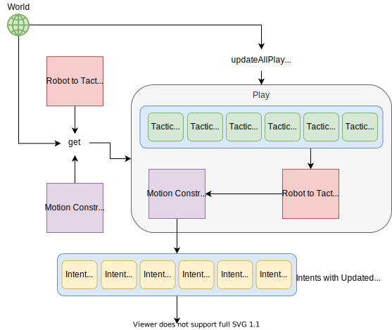

# Architecture and Design Rationales

# Table of Contents
* [Tools](#tools)
  * [SSL-Vision](#ssl-vision)
  * [SSL-Gamecontroller](#ssl-gamecontroller)
* [Important Classes](#important-classes)
  * [World](#world)
    * [Team](#team)
    * [Robot](#robot)
    * [Ball](#ball)
    * [Field](#field)
    * [GameState](#gamestate)
  * [Intents](#intents)
  * [Dynamic Parameters](#dynamic-parameters)
* [Protobuf](#protobuf)
  * [Important Protobuf Messages](#important-protobuf-messages)
    * [Primitives](#primitives)
    * [Robot Status](#robot-status)
* [Design Patterns](#design-patterns)
  * [Abstract Classes and Inheritance](#abstract-classes-and-inheritance)
  * [Singleton Design Pattern](#singleton-design-pattern)
  * [Factory Design Pattern](#factory-design-pattern)
  * [Visitor Design Pattern](#visitor-design-pattern)
  * [Observer Design Pattern](#observer-design-pattern)
  * [C++ Templating](#c-templating)
* [Coroutines](#coroutines)
  * [What Are Coroutines?](#what-are-coroutines)
  * [What Coroutines Do We Use?](#what-coroutines-do-we-use)
  * [How Do We Use Coroutines?](#how-do-we-use-coroutines)
  * [Best Practices](#couroutine-best-practices)
* [Finite State Machines](#finite-state-machines)
  * [What Are Finite State Machines?](#what-are-finite-state-machines)
  * [Boost-Ext SML Library](#boost-ext-sml-library)
  * [How Do We Use SML?](#how-do-we-use-sml)
  * [SML Best Practices](#sml-best-practices)
* [Conventions](#conventions)
  * [Coordinates](#coordinates)
  * [Angles](#angles)
  * [Diagram](#convention-diagram)
* [Architecture Overview](#architecture-overview)
  * [Diagram](#architecture-overview-diagram)
  * [Backend](#backend)
    * [Diagram](#backend-diagram)
  * [Sensor Fusion](#sensor-fusion)
    * [Filters](#filters)
  * [AI](#ai)
    * [Strategy](#strategy)
      * [STP Diagram](#stp-diagram)
      * [Tactics](#tactics)
      * [Plays](#plays)
    * [Navigation](#navigation)
      * [Path Manager](#path-manager)
      * [Path Objective](#path-objective)
      * [Path Planner](#path-planner)
    * [Diagram](#ai-diagram)
  * [Thunderscope](#thunderscope)
    * [Inter-process Communication](#inter-process-communication)
  * [Estop](#estop)
* [Simulator](#simulator)
  * [Standalone Simulator](#standalone-simulator)
  * [Simulated Tests](#simulated-tests)
    * [Architecture](#simulated-tests-architecture)
      * [Validation Functions](#validation-functions)
    * [Component Connections and Determinism](#component-connections-and-determinism)
    * [Diagram](#simulated-tests-diagram)


# Tools
A few commonly-used terms and tools to be familiar with:
#### SSL-Vision
  * This is the shared vision system used by the Small Size League. It is what connects to the cameras above the field, does the vision processing, and transmits the positional data of everything on the field to our [AI](#ai) computers.
  * The GitHub repository can be found [here](https://github.com/RoboCup-SSL/ssl-vision)
#### SSL-Gamecontroller
  * Sometimes referred to as the "Referee", this is another shared piece of Small Size League software that is used to send gamecontroller and referee commands to the teams. A human controls this application during the games to send the appropriate commands to the robots. For example, some of these commands are what stage the gameplay is in, such as `HALT`, `STOP`, `READY`, or `PLAY`.
  * The GitHub repository can be found [here](https://github.com/RoboCup-SSL/ssl-game-controller)


# Important Classes
These are classes that are either heavily used in our code, or are very important for understanding how the AI works, but are _not_ core components of the AI or other major modules. To learn more about these core modules and their corresponding classes, check out the sections on the [Backend](#backend), [Sensor Fusion](#sensor-fusion), [AI](#ai), and [Thunderscope](#thunderscope).

## World
The `World` class is what we use to represent the state of the world at any given time. In this context, the world includes the positions and orientations of all robots on the field, the position and velocity of the ball, the dimensions of the field being played on, and the current referee commands. Altogether, it's the information we have at any given time that we can use to make decisions.

### Team
A team is a collection of [Robots](#robot)

### Robot
A Robot class represents the state of a single robot on the field. This includes its position, orientation, velocity, angular velocity, and any other information about its current state.

### Ball
The Ball class represents the state of the ball. This includes its position and velocity, and any other information about its current state.

### Field
The Field class represents the state of the physical field being played on, which is primarily its physical dimensions. The Field class provides many functions that make it easy to get points of interest on the field, such as the enemy net, friendly corner, or center circle. Also see the [coordinate convention](#coordinates) we use for the field (and all things on it).

### GameState
These represent the current state of the game as dictated by the Gamecontroller. These provide functions like `isPlaying()`, `isHalted()` which tell the rest of the system what game state we are in, and make decisions accordingly. We need to obey the rules!

## Intents
An `Intent` represents a simple thing the [AI](#ai) wants (or intends for) a robot to do, but is at a level that requires knowledge of the state of the game and the field (e.g. Referee state, location of the other robots). It does not represent or include _how_ these things are achieved. Some examples are:
* Moving to a position without colliding with anything on its way and while following all rules
* Pivoting around a point
* Kicking the ball at a certain direction or at a target

There are two types of `Intent`s: `DirectPrimitiveIntent`s and `NavigatingIntent`s. `DirectPrimitiveIntent`s directly represent the [Primitives](#primitives) that the AI is trying to send to the robots. `NavigatingIntent`s are intents that require moving while avoiding obstacles, so they contain extra parameters to help with [Navigation](#navigation).

## Dynamic Parameters
`Dynamic Parameters` are the system we use to change values in our code at runtime. The reason we want to change values at runtime is primarily because we may want to tweak our strategy or aspects of our gameplay very quickly. During games we are only allowed to touch our computers and make changes during halftime or a timeout, so every second counts! Using `Dynamic Parameters` saves us from having to stop the [AI](#ai), change a constant, recompile the code, and restart the [AI](#ai).

Additionally, we can use `Dynamic Parameters` to communicate between [Thunderscope](#thunderscope) and the rest of our system. [Thunderscope](#thunderscope) can change the values of `DynamicParameters` when buttons or menu items are clicked, and these new values will be picked up by the rest of the code. For example, we can define a `Dynamic Parameter` called `run_ai` that is a boolean value. Then when the `Start [AI](#ai)` button is clicked in [Thunderscope](#thunderscope), it sets the value of `run_ai` to `true`. In the "main loop" for the [AI](#ai), it will check if the value of `run_ai` is true before running its logic.

Here's a slightly more relevant example of how we used `Dynamic Parameters` during a game in RoboCup 2019. We had a parameter called `enemy_team_can_pass`, which indicates whether or not we think the enemy team can pass. This parameter was used in several places in our defensive logic, and specifically affected how we would shadow enemy robots when we were defending them. If we assumed the enemy team could pass, we would shadow between the robots and the ball to block any passes, otherwise we would shadow between the enemy robot and our net to block shots. During the start of a game, we had `enemy_team_can_pass` set to `false` but the enemy did start to attempt some passes during the game. However, we didn't want to use one of our timeouts to change the value. Luckily later during the half, the enemy team took a time out. Because `Dynamic Parameters` can be changed quick without stopping [AI](#ai), we were quickly able to change `enemy_team_can_pass` to `true` while the enemy team took their timeout. This made our defence much better against that team and didn't take so much time that we had to burn our own timeout. Altogether this is an example of how we use `Dynamic Parameters` to control our [AI](#ai) and other parts of the code.

It is worth noting that constants are still useful, and should still be used whenever possible. If a value realistically doesn't need to be changed, it should be a constant (with a nice descriptive name) rather than a `Dynamic Parameter`. Having too many `Dynamic Parameters` is overwhelming because there are too many values to understand and change, and this can make it hard to tune values to get the desired behaviour while under pressure during a game.


# Protobuf
[Protobuf or protocol buffers](https://protobuf.dev/) are used to pass messages between components in our system.
After building using Bazel, the `.proto` files are generated into `.pb.h` and `.pb.cc` files, which are found in `bazel-out/k8-fastbuild/bin/proto`.
To include these files in our code, we simply include `proto/<protobuf_filename>.pb.h`

## Important Protobuf Messages
These are [protobuf](https://developers.google.com/protocol-buffers/docs/cpptutorial) messages that we define and that are important for understanding how the [AI](#ai) works.

### Primitives
`TbotsProto::Primitive`s represent simple actions that robots blindly execute (e.g. send signals to motor drivers), so it's up to the [AI](#ai) to send `Primitives` that follow all the rules and avoid collisions with obstacles. Some examples are:
* Moving in a straight line to a position
* Pivoting around a point
* Kicking the ball at a certain direction

`Primitives` act as the abstraction between our [AI](#ai) and our robot firmware. It splits the responsibility such that the [AI](#ai) is responsible for sending a `Primitive` to a robot telling it what it wants it to do, and the robot is responsible for making sure it does what it's told. For every `Primitive` protobuf message, there is an equivalent `Primitive` implementation in our robot firmware. When robots receive a `Primitive` command, they perform their own logic and control in order to perform the task specified by the `Primitive`.

### Robot Status
The `TbotsProto::RobotStatus` protobuf message contains information about the status of a single robot. Examples of the information they include are:
* Robot battery voltage
* Whether or not the robot senses the ball in the breakbeam
* The capacitor charge on the robot
* The temperature of the dribbler motor

Information about the robot status is communicated and stored as `RobotStatus` protobuf messages. [Thunderscope](#thunderscope) displays warnings from incoming `RobotStatus`es so we can take appropriate action. For example, during a game we may get a "Low battery warning" for a certain robot, and then we know to substitute it and replace the battery before it dies on the field.

# Design Patterns
Below are the main design patterns we use in our code, and what they are used for.

## Abstract Classes and Inheritance
Abstract classes let us define interfaces for various components of our code. Then we can implement different objects that obey the interface, and use them interchangeably, with the guarantee that as long as they follow the same interface we can use them in the same way.

Read [https://www.geeksforgeeks.org/inheritance-in-c/] for more information.

Examples of this can be found in many places, including:
* [Plays](#plays)
* [Tactics](#tactics)
* [Intents](#intents)
* Different implementations of the [Backend](#backend)


## Singleton Design Pattern
The Singleton pattern is useful for having a single, global instance of an object that can be accessed from anywhere. Though it's generally considered an anti-pattern (aka _bad_), it is useful in specific scenarios.

Read [https://www.tutorialspoint.com/Explain-Cplusplus-Singleton-design-pattern] for more information.

We use the Singleton pattern for our logger. This allows us to create a single logger for the entire system, and code can make calls to the logger from anywhere, rather than us having to pass a `logger` object literally everywhere.


## Factory Design Pattern
The Factory Design Pattern is useful for hiding or abstracting how certain objects are created.

Read [https://www.geeksforgeeks.org/design-patterns-set-2-factory-method/] for more information.

Because the Factory needs to know about what objects are available to be created, it can be taken one step further to auto-register these object types. Rather than a developer having to remember to add code to the Factory every time they create a new class, this can be done "automatically" with some clever code. This helps reduce mistakes and saves developers work.

Read [http://derydoca.com/2019/03/c-tutorial-auto-registering-factory/] for more information.

The auto-registering factory is particularly useful for our `PlayFactory`, which is responsible for creating [Plays](#plays). Every time we run our [AI](#ai) we want to know what [Plays](#plays) are available to choose from. The Factory pattern makes this really easy, and saves us having to remember to update some list of "available Plays" each time we add or remove one.

The Factory pattern is also used to create different [Backends](#backend)


## Visitor Design Pattern
The `Visitor Design Pattern` is arguably the most "advanced" design pattern we use. It is used when we need to perform different operations on a group of "similar" objects, for example a bunch of objects that inherit from the same parent class ([Intents](#intents)). We might only know all these objects are an [Intent](#intent), but we don't know specifically which type each one is (eg. `MoveIntent` vs `KickIntent`). The Visitor Pattern helps us "recover" that type information so we can perform different operations on the different types of objects. It is generally preferred to a big `if-block` with a case for each type, because the compiler can help warn you when you've forgotten to handle a certain type, and therefore helps prevent mistakes.

Read [https://www.geeksforgeeks.org/visitor-design-pattern/] for more information.

Examples of the Visitor Pattern can be found with the following classes:
* [Intents](#intents)
* [Tactics](#tactics)


## Observer Design Pattern
The Observer Design Pattern is useful for letting components of a system "notify" each other when something happens. Read [https://www.geeksforgeeks.org/observer-pattern-set-1-introduction/] for a general introduction to the pattern.

Our implementation of this pattern consists of two classes, `Observer` and `Subject`. `Observer`s can be registered with a `Subject`, after which new values will be sent from each `Subject` to all of it's registered `Observer`s. Please see the headers of both classes for details. Note that a class can extend both `Observer` and `Subject`, thus receiving and sending out data. In this way we can "chain" multiple classes.

### Threaded Observer
In our system, we need to be able to do multiple things (receive camera data, run the [AI](#ai), send commands to the robots) at the same time. In order to facilitate this, we extend the `Observer` to the `ThreadedObserver` class. The `ThreadedObserver` starts a thread with an infinite loop that waits for new data from `Subject` and performs some operation with it.

**WARNING:** If a class extends multiple `ThreadedObserver`s (for example, [AI](#ai) could extend `ThreadedObserver<World>` and `ThreadedObserver<RobotStatus>`), then there will be two threads running, one for each observer. We **do not check** for data race conditions between observers, so it's entirely possible that one `ThreadedObserver` thread could read/write from data at the same time as the other `ThreadedObserver` is reading/writing the same data. Please make sure any data read/written to/from multiple `ThreadedObserver`s is thread-safe.

### Example
One example of this is [SensorFusion](#sensor-fusion), which extends `Subject<World>` and the [AI](#ai), which extends `ThreadedObserver<World>`. [SensorFusion](#sensor-fusion) runs in one thread and sends data to the [AI](#ai), which receives and processes it another thread.

## C++ Templating
While debatably not a design pattern depending on who you ask, templating in C++ is a powerful tool that is very useful to understand. [https://www.geeksforgeeks.org/templates-cpp/] gives a great explanantion and example.

We use templating in a few places around the codebase, with the most notable examples being our [Factory Design Patterns](#factory-design-pattern), and our `Gradient Descent` optimizer.


# Coroutines
## What Are Coroutines?
Coroutines are a general control structure where the flow control is cooperatively passed between two different routines without returning, by allowing execution to be suspended and resumed. This is very similar to the `yield` statement and generators in `Python`.

Rather than using the `return` keyword to return data, coroutines use the `yield` keyword. The main difference is that when `return` is encountered, the data is returned and the function terminates. If the function is called again, it starts back from the beginning. On the other hand, when `yield` is encountered some data is returned, but the state of the function / coroutine is saved and the function does not terminate. This means that when the function is called again, execution resumes immediately after the `yield` statement that previously returned the data, with all the previous context (variables, etc) as if the function never stopped running. This is the "suspend and resume" functionality of coroutines.

See the following C++ pseudocode for an example. This coroutine function computes and returns the fibonacci sequence.
```
int fib(Coroutine::push_type& yield) {
    int f1 = 1;
    int f2 = 0;
    while(true) {
        int fn = f1 + f2; // Compute the next value in the sequence
        f2 = f1; // Save the previous 2 values
        f1 = fn;
        yield(fn);
    }
}

int main() {
    // Coroutine setup stuff
    // Lets pretend that we have created the Coroutine and called it `yield`
    std::cout << fib(yield) << std::endl; // Prints 1
    std::cout << fib(yield) << std::endl; // Prints 2
    std::cout << fib(yield) << std::endl; // Prints 3
    std::cout << fib(yield) << std::endl; // Prints 5
    std::cout << fib(yield) << std::endl; // Prints 8
    // and so on...
}
```
Lets walk through what's happening here:
1. The first time the `fib` function is called, the variables `f1` and `f2` are initialized, and we go through the first iteration of the loop until `yield` is encountered
2. The `yield` statement is going to return the currently computed value of the fibonacci sequence (the variable `fn`) and save the state of the `fib` function
    * "yielding" the data here is effectively returning it so that the code in the `main` function can print the result
3. The second time `main()` calls the `fib()` function, the function will resume immediately after the `yield()` statement. This means that execution will go back to the top of the loop, *and still remember the values of `f1` and `f2` from the last time the function was called*. Since the coroutine saved the function state, it still has the previous values of `f1` and `f2` which it uses to compute the next value in the sequence.
4. Once again when the `yield()` statement is reached, the newly computed value is returned and the function state is saved. You can think of this as "pausing" the function.
5. As `main()` keeps calling the `fib()` function, it is computing and returning the values of the fibonacci sequence, and this only works because the coroutine "remembers" the values from each previous fibonacci computation which it uses to compute the next value the next time the function is called.
    * If the `yield` was replaced with a regular `return` statement, the function would only ever return the value `1`. This is because using `return` would not save the function state, so the next time it's called the function would start at the beginning again, and only ever compute the first value of the sequence.


This example / pseudocode does hide away some details about how coroutines are set up and how we extract values from them, but it's most important to understand how coroutines change the flow of control in the program.


## What Coroutines Do We Use?
We use the [boost Coroutine2 library](https://www.boost.org/doc/libs/1_71_0/libs/coroutine2/doc/html/index.html). Specifically, we use Asymmetric Coroutines.

[This stackoverfow answer](https://stackoverflow.com/a/42042904) gives a decent explanation of the difference between Symmetric and Asymmetric Coroutines, but understanding the difference is not critical for our purposes. We use Asymmetric Coroutines because boost does not provide Symmetric Coroutines, and the hierarchical structure of Asymmetric Coroutines is more useful to us.


## How Do We Use Coroutines?
We use Coroutines to write our [strategy logic](#strategy). The "pause and resume" functionality of Coroutines makes it much easier to write [Plays](#plays).

Specifically, we use Coroutines as a way to break down our strategy into "stages". Once a "stage" completes we generally don't want to re-evaluate it, and would rather commit to a decision and move on. Coroutines makes it much easier to write "stages" of strategy without requiring complex state machine logic to check what stage we are in, and it's easier for developers to see what the intended order of operations is (eg. "Line up to take the shot" -> "shoot").

In the past, we had issues with our gameplay logic "committing" to decisions if we were near certain edge cases. This caused robots to behave oddly, and sometimes get significantly slowed down in "analysis paralysis". Coroutines solve this problem by allowing us to write "stages" that execute top-to-bottom in a function, and once we make a decision we commit to it and move on to the next stage.

Here's a more specific example. In this example we are going to pretend to write a [Tactic](#tactic) that will pass the ball.
```
def executeStrategy(IntentCoroutine::push_type& yield, Pass pass) {
    do {
        yield(/* align the robot to make the pass */)
    }while(current_time < pass.start_time);
    
    do {
        yield(/* kick the ball at the pass location */)
    }while(/* robot has not kicked the ball */)
}
```
We will pretend that this function is getting called 30 times per second to get the most up-to-date gameplay decision.

In this example, each `do while()` loop is a "stage". When the function is first called, we enter the first stage. In this stage, we will keep telling the robot to line up behind the ball to be ready to make the pass. The robot will continue to do this until it is time to start the pass.

Once it is time to start the pass, the condition for the loop will become false and we will exit the loop. Then we enter the second loop / stage. The second stage tells the robot to kick the ball, and this continues until the ball has been kicked. Once the ball has been kicked, the loop will terminate and the function will end because the execution reaches the end of the function.

Once we have entered the second stage, we know we don't have to look at the first stage again. Because the coroutine "remembers" where the execution is each time the function is called, we will resume inside the second stage and therefore never execute the first stage again! This makes it much easier to write and read this strategy code, because we can clearly see the 2 stages of the strategy, and we know they will be executed in order.

## Couroutine Best Practices
Coroutines are a complex feature, and the boost coroutines we use don't always behave in was we expect. We have done extensive testing on how coroutines are safe (or not safe) to us, and derived some best practices from these examples. See [coroutine_test_exmaples.cpp](coroutine_test_examples.cpp) for the full code and more detailed explanantions.

To summarize, the best practices are as follows:
1. Avoid moving coroutines. If the absolutely must be moved, make sure they are not moved between the stack and heap.
2. Avoid using coroutines with resizable containers. If they must be used, make sure that the coroutines are allocated on the heap.
3. Pass data to the coroutine on creation as much as possible, avoid using member variables.

# Finite State Machines
## What Are Finite State Machines?
A finite state machine (FSM) is a system with a finite number of states with defined transitions and outputs based on the inputs to the system. In particular, we are interested in hierarchical state machines where we can transition between states in terms of _when_ states should transition (_guards_) and _what_ should happen when transitions occur (_actions_), given a specific input (_event_). Hierarchical state machines are state machines that are composed of one or more FSMs, which we call sub-FSMs. The parent FSM can treat a sub-FSM as a state with _guards_ and _actions_ when transitioning to and from the sub-FSM. When the sub-FSM enters a terminal state, the parent FSM is able to automatically transition to another state.


[source](https://www.block-net.de/Programmierung/cpp/fsm/fsm.html)

## Boost-ext SML Library
We use the [Boost-Ext SML](https://github.com/boost-ext/sml), short for State Machine Library, to manage our finite state machines. This library defines state machines through a transition table, where a row indicates the transition from one state to another subject to _guards_, _actions_ and _events_. The syntax of a row of the transition table looks like this:
```
src_state + event [guard] / action = dest_state
```
where the src\_state transitions to the dest\_state, while performing the _action_, only if the _event_ is processed and the _guard_ is true. Events are structs of new information that FSMs receive, so _guards_ and _actions_ take events as arguments. _Guards_ must return a boolean and _actions_ must return void. An asterix (\*) at the start of a row indicates that the state is an initial state. The rows of the transition table are processed in order and the first row to match is executed.

The library also supports hierarchical FSMs. Sub-FSMs are treated as states where an unconditional transition occurs when the sub-FSM is in the terminal state, X.
```
/* omitted rows of transition table */
SubFSM = next_state, // Transitions to next_state only when the SubFSM is in the terminal state, X
/* omitted rows of transition table */
```
In order to update a subFSM with an event, we need to do the following:
```
const auto update_sub_fsm_action =
    [](auto event, back::process<TypeOfSubFSMEvent> processEvent) {
        TypeOfSubFSMEvent sub_fsm_event = // initialize the subFSM event
        processEvent(sub_fsm_event);
    };
```
The convenience of this syntax comes at the cost of hard to read error messages due to the functor and templating system.

## How Do We Use SML?
We use SML to manage our [Tactics](#tactic). Each state represents a stage in the tactic where the robot should be doing a particular action or looking for certain conditions to be true. An example of this is the MoveFSM. While the robot is not at the destination and oriented correctly, the FSM is in the move state. Once the robot reaches its destination, it enters the terminal state, _X_, to indicate that it's done. SML also allows us to easily reuse FSMs in other tactics. For example, if a shadowing tactic needs to move to a particular destination with a certain orientation, then it can use the MoveFSM as a sub-FSM state.

## SML Best Practices
Boost-ext SML is a library that supports complex functionality with similarly complex syntax and semantics. If complex syntax is misused, the complicated error messages can make development difficult. Thus, we need to carefully choose a standardized subset of the library's syntax to implement our functionality while maintaining high readability.
* Only use one _event_ per FSM: In gameplay, we react to changes in the [World](#world), so since there's only one source of new information, we should only need one _event_
* Only one _guard_ or _action_ per transition: For readability of the transition table, we should only have one _guard_ or _action_ per transition. This can always be achieved by defining a _guard_ or _action_ outside of the transition table that checks multiple conditions or performs multiple actions if that's required.
* Define _guards_ and _actions_ outside of the transition table: The names of _guards_ and _actions_ should be succinct so that transition tables rows fit on one line and readers can easily understand the FSM from the transition table. In other words, no lambdas/anonymous functions in transition tables.
* States should be defined as classes in the FSM struct so that users of the FSM can check what state the FSM is in: 
```
    // inside the struct
    class KickState;
    // inside the operator()()
    const auto kick_s = state<KickState>;
    // allows for this syntax
    fsm.is(boost::sml::state<MyFSM::MyState>)
```
* Avoid entry and exit conditions: Everything that can be implemented with entry and exit conditions can easily be implemented as actions, so this rule reduces source of confusion for the reader
* Avoid self transitions, i.e. `src_state + event [guard] / action = src_state`: self transitions call entry and exit conditions, which complicates the FSM. If we want a state to stay in the same state while performing an action, then we should use an internal transition, i.e. `src_state + event [guard] / action`.
* Avoid orthogonal regions: Multiple FSMs running in parallel is hard to reason about and isn't necessary for implementing single robot behaviour. Thus, only prefix one state with an asterix (\*)
* Use callbacks in _events_ to return information from the FSM: Since the SML library cannot directly return information, we need to return information through callbacks. For example, if we want to return a double from an FSM, we can pass in `std::function<void(double)> callback` as part of the event and then make the _action_ call that function with the value we want returned.
* When a variable needs to be shared between multiple states or can be initialized upon construction of the FSM, then define a private member and constructor in the FSM struct, and pass that in when constructing the FSM. Here's a code snippet:
```
(drive_forward_fsm.h)
DriveForwardFSM
{
   public:
    DriveForwardFSM(double max_speed): max_speed(max_speed){}
   private:
    double max_speed;
}
(drive_forward_tactic.h)
    FSM<DriveForwardFSM> fsm;
(drive_forward_tactic.cpp: constructor)
    fsm(DriveForwardFSM(10.0))
```

# Conventions
Various conventions we use and follow that you need to know.

## Coordinates
We use a slightly custom coordinate convention to make it easier to write our code in a consistent and understandable way. This is particularly important for any code handling gameplay logic and positions on the field.

The coordinate system is a simple 2D x-y plane. The x-dimension runs between the friendly and enemy goals, along the longer dimension of the field. The y-dimension runs perpendicular to the x-dimension, along the short dimension of the field.

Because we have to be able to play on either side of a field during a game, this means the "friendly half of the field" will not always be in the positive or negative x part of the coordinate plane. This inconsistency is a problem when we want to specify points like "the friendly net", or "the enemy corner". We can't simple say the friendly net is `(-4.5, 0)` all the time, because this would not be the case if we were defending the other side of the field where the friendly net would be `(4.5, 0)`.

In order to overcome this, our convention is that:
* The **friendly half** of the field is **always negative x**, and the **enemy half** of the field is **always positive x**
* `y` is positive to the "left" of someone looking at the enemy goal from the friendly goal
* The center of the field (inside the center-circle) is the origin / `(0, 0)`

This is easiest to understand in the [diagram](#convention-diagram) below.

Based on what side we are defending, [Sensor Fusion](#sensor-fusion) will transform all the coordinates of incoming data so that it will match our convention. This means that from the perspective of the rest of the system, the friendly half of the field is always negative x and the enemy half is always positive x. Now when we want to tell a robot to move to the friendly goal, we can simply tell it so move to `(-4.5, 0)` and we know this will _always_ be the friendly side. All of our code is written with the assumption in mind.

## Angles
Going along with our coordinate convention, we have a convention for angles as well. An Angle of `0` is along the positive x-axis (facing the enemy goal), and positive rotation is counter-clockwise (from a perspective above the field, looking at it like a regular x-y plane where +y is "up"). See the [diagram](#convention-diagram) below.

Because of our [Coordinate Conventions](#coordinates), this means that an angle of `0` will always face the enemy net regardless of which side of the field we are actually defending.

## Convention Diagram


# Architecture Overview
At a high-level our system is made of 4 main components: The [Backend](#backend), the [Sensor Fusion](#sensor-fusion), the [AI](#ai), and [Thunderscope](#thunderscope). These 4 components each run in their own thread, and communicate with each other using the [Observer design pattern](#observer-design-pattern).

The [Backend](#backend) is responsible for communicating with the outside world (network and radio), [Sensor Fusion](#sensor-fusion) is responsible for processing and filtering raw data, the [AI](#ai) makes the actual gameplay decisions, and [Thunderscope](#thunderscope) shows us what's happening and lets us control the [AI](#ai).

Each component is described in more detail in their own sections.

#### Architecture Overview Diagram


# Backend
The `Backend` is responsible for all communication with the "outside world". The responsibilities of the `Backend` can be broken down into communication using `SensorProto` and [Primitives](#primitives) messages:

* Upon receiving the following messages from the network (outside world), the `Backend` will store it in a `SensorProto` message and send it to [Sensor Fusion](sensor-fusion):
  * Robot status messages
  * Vision data about where the robots and ball are (typically from [SSL-Vision](#ssl-vision))
  * Referee commands (typically from the [SSL-Gamecontroller](#ssl-gamecontroller)

* Upon receiving [Primitives](#primitives) from the [AI](#ai), `Backend` will send the primitives to the robots or the [Simulator](#simulator).

The `Backend` was designed to be a simple interface that handles all communication with the "outside world", allowing for different implementations that can be swapped out in order to communicate with different hardware / protocols / programs.

#### Backend Diagram


# Sensor Fusion
`Sensor Fusion` is responsible for processing the raw data contained in SensorProto into a coherent snapshot of the [World](#world) that the [AI](#ai) can use. It invokes filters to update components of [World](#world), and then combines the components to send out the most up-to-date version.

## Filters
Filters take the raw data from SensorProto and returns an updated version of a component of the [World](#world). For example, the `BallFilter` takes `BallDetection`s and returns an updated `Ball`.

* **Why we need to do this:** Programs that provide data like [SSL-Vision](#ssl-vision) only provide raw data. This means that if there are several orange blobs on the field, [SSL-Vision](#ssl-vision) will tell us the ball is in several different locations. It is up to us to filter this data to determine the "correct" position of the ball. The same idea applies to robot positions and other data we receive.

Filters provide a flexible way to modularize the processing of raw data, making it easy to update filters and add new ones. Filters are sometimes stateful. For example, the `BallFilter` "remembers" previous locations of the ball in order to estimate the ball's current velocity.


# AI
The `AI` is where all of our gameplay logic takes place, and is the main "brain" of our system. It uses the information received from [Sensor Fusion](#sensor-fusion) to make decisions, and sends [Primitives](#primitives) to the [Backend](#backend) for the robots to execute. All together this feedback loop is what allows us to react to what's happening on the field and play soccer in real-time.

The 2 main components of the `AI` are strategy and navigation.

## Strategy
We use a framework called `STP (Skills, Tactics, Plays)` to implement our stratgy. The `STP` framework was originally proposed by Carnegie Mellon University back in 2004. The original paper can be found [here](https://kilthub.cmu.edu/articles/STP_Skills_Tactics_and_Plays_for_Multi-Robot_Control_in_Adversarial_Environments/6561002/1).

`STP` is a way of breaking down roles and responsibilities into a simple hierarchy, making it easier to build up more complex strategies from simpler pieces. This is the core of where our strategy is implemented.

When the [AI](#ai) is given new information and asked to make a decision, our `STP` strategy is what is executed first. It takes in a [World](#world) and returns [Intents](#intents).

###  STP Diagram
The STP diagram shows how this works. Functions to assign tactics to robots and build motion constraints are passed into a `Play`'s `get` function, which the `Play` uses to generate tactics with assigned robots and with updated motion constraints.



### Tactics
The `T` in `STP` stands for `Tactics`. A `Tactic` represents a "single-robots' role" on a team. Examples include:
1. Being a goalie
2. Being a passer or pass receiver
3. Being a defender that shadows enemy robots
4. Being a defender that tries to steal the ball from enemies

They can also represent lower level behaviours, such as
1. Moving to a position (without colliding with anything)
2. Shooting the ball at a target
3. Intercepting a moving ball

The high level behaviours can use the lower level behaviours in a hierarchical way.

Tactics use [Intents](#intents) to implement their behaviour, so that it can decouple strategy from the [Navigator](#navigation).

### Plays
The `P` in `STP` stands for `Plays`. A `Play` represents a "team-wide goal" for the robots. They can be thought of much like Plays in real-life soccer. Examples include:
1. A Play for taking friendly corner kicks
2. A Play for defending enemy kickoffs
3. A general defense play
4. A passing-based offense play
5. A dribbling-based offense play

Plays are made up of `Tactics`. Plays can have "stages" and change what `Tactics` are being used as the state of the game changes, which allows us to implement more complex behaviour. Read the section on [Coroutines](#coroutines) to learn more about how we write strategy with "stages".

Furthermore, every play specifies an `Applicable` and `Invariant` condition. These are used to determine what plays should be run at what time, and when a Play should terminate.

`Applicable` indicates when a `Play` can be started. For example, we would not want to start a `Defense Play` if our team is in possession of the ball. The `Invariant` condition is a condition that must always be met for the `Play` to continue running. If this condition ever becomes false, the current `Play` will stop running and a new one will be chosen. For example, once we start running a friendly `Corner Kick` play, we want the `Play` to continue running as long as the enemy team does not have possession of the ball.


## Navigation
The `Navigator` is responsible for path planning and navigation. Once our strategy has decided what it wants to do, it passes the resulting [Intents](#intents) to the `Navigator`. The `Navigator` is then responsible for breaking down the [Intents](#intents) and turning them into [Primitives](#primitives).

[DirectPrimitiveIntents](#intents) are easy to break down into [Primitives](#primitives), and can be converted directly without having to do any extra work.

However, [NavigatingIntents](#intents) like the `MoveIntent` rely on the navigator to implement more complex behaviour like obstacle avoidance.  In order for a robot to move to the desired destination of a [NavigatingIntents](#intents), the `Navigator` will use various path-planning algorithms to find a path across the field that does not collide with any robots or violate any restrictions set on the [NavigatingIntents](#intents). The `NavigatingPrimitiveCreator` then translates this path into a series of [Primitives](#primitives), which are sent to the robot sequentially so that it follows the planned path across the field.

### Path Manager
The `Path Manager` is responsible for generating a set of paths that don't collide. It is given a set of [Path Objective](#path-objective)s and [Path Planner](#path-planner), and it will generate paths using the given path planner and arbitrate between paths to prevent collisions.

### Path Objective
A path objective is a simple datastructure used to communicate between the navigator and the path manager. It conveys information for generating one path, such as start, destination, and obstacles. Path Objectives use very simple datastructures so that Path Planners do not need to know about any world-specific datastructures, such as Robots or the Field.

### Path Planner
The `Path Planner` is an interface for the responsibility of path planning a single robot around a single set of obstacles from a given start to a given destination. The interface allows us to easily swap out path planners.

## [AI](#ai) Diagram


# Thunderscope
[Thunderscope](#thunderscope) is our main visualizer of our [AI](#ai). It provides a GUI that shows us the state of the [World](#world), and is also able to display extra information that the [AI](#ai) would like to show. For example, it can show the planned paths of each friendly robot on the field, or highlight which enemy robots it thinks are a threat. Furthermore, it displays any warnings or status messages from the robots, such as if a robot is low on battery.

Thunderscope also lets us control the [AI](#ai) by setting [Dynamic Parameters](#dynamic-parameters). Through Thunderscope, we can manually choose what strategy the [AI](#ai) should use, what colour we are playing as (yellow or blue), and tune more granular behaviour such as how close an enemy must be to the ball before we consider them a threat.

Thunderscope is implemented using [PyQtGraph](https://www.pyqtgraph.org/), a Python graphics and GUI library. PyQtGraph is built upon [PyQt](https://riverbankcomputing.com/software/pyqt/intro), which provides Python bindings for [Qt](https://www.qt.io/), a C++ library for creating cross-platform GUIs. The general documentation for [Qt](https://www.qt.io/) can be found [here](https://doc.qt.io/qt-5/index.html). The most important parts of Qt to understand are:

* [Widgets](https://doc.qt.io/qt-5/qtwidgets-index.html)
* [Layouts](https://doc.qt.io/qt-6/layout.html)
* [Signals and Slots](https://doc.qt.io/qt-5/signalsandslots.html)

## Inter-process Communication
Since [Thunderscope](#thunderscope) runs in a separate process from our [AI](#ai), we use [Unix domain sockets](https://en.wikipedia.org/wiki/Unix_domain_socket) to facilitate communication between our AI and Thunderscope. Unix sockets [have high throughput and are very performant](https://stackoverflow.com/a/29436429/20199855); we simply bind the unix socket to a file path and pass data between processes, instead of having to deal with TCP/IP overhead just to send and receive data on the same computer.

The data sent between the AI and Thunderscope is serialized using [protobufs](#protobuf). In order to get protobufs from anywhere in our C++ full system (backend, pass generator, navigator, FSMs, sensor fusion, etc.) sent to Thunderscope, we convert the protobufs to strings and log them using the [`g3log`](https://kjellkod.github.io/g3log/) logger used throughout our codebase. `g3log` is a fast and thread-safe way to log strings with custom handlers called “sinks". We don’t want to dependency inject a "communication" object everywhere we have visualizable data to send to the visualizer, so we use `g3log` to have a static singleton that can be called anywhere. 

<details>
<summary><b>Aside: calling <code>g3log</code> to log protobuf data</b></summary>
Logging protobufs is done at the <code>VISUALIZE</code> level (e.g. <code>LOG(VISUALIZE) << some_random_proto;</code>). We've overloaded the stream (<code><<</code>) operator to automatically pack protobufs into a <code>google::protobuf::Any</code> and serialize them to a string, so you don't need to do the conversion yourself.
</details><br>

Logging a protobuf will send it to our custom protobuf `g3log` sink, which lazily initializes unix senders based on the type of protobuf that is logged. The sink then sends the protobuf over the socket to listeners.

On the Python (Thunderscope) side, the [`ProtoUnixIO`](../src/software/thunderscope/proto_unix_io.py) is responsible for communicating protobufs over unix sockets. Through `ProtoUnixIO`, classes can register as an [observer](#observer-design-pattern) by providing a protobuf type to observe and a [`ThreadSafeBuffer`](../src/software/thunderscope/thread_safe_buffer.py) to place incoming data. The `ProtoUnixIO` can then be configured with a unix receiver to receive protobufs over a unix socket and send data to all observers of that proto type. Classes can also send out protobufs via `ProtoUnixIO`, which will relay the data to any registered observers.

# Estop
`Estop` allows us to quickly and manually command physical robots to stop what they are doing. We have a couple of implementations of `Estop`, depending on which [Backend](#backend) is being used:

* For `WifiBackend`, the `Estop` is a stateful switch connected to an Arduino. The switch state is communicated to the `WifiBackend` regularly. When `Estop` is in a `STOP` state, the `WifiBackend` overrides the [Primitives](#primitives) sent to the robot to an `Estop primitive`. when it is in a `PLAY` state, primitives are communicated normally.
* For `RadioBackend`, The `Estop` switch is part of the Radio dongle, which is responsible for filtering out messages sent to the robots. 

# Simulator
The `Simulator` is what we use for physics simulation to do testing when we don't have access to real field. In terms of the architecture, the `Simulator` "simulates" the following components' functionalities:
* [SSL-Vision](#ssl-vision) by publishing new vision data
* the robots by accepting new [Primitives](#primitives)

Using the current state of the simulated world, the `Simulator` simulates the new [Primitives](#primitives) over some time step and publishes new ssl vision data based on the updated simulated world. The `Simulator` is designed to be "perfect", which means that
* the vision data it publishes exactly reflects the state of the simulated world
* the simulation perfectly reflects our best understanding of the physics (e.g. friction) with no randomness.

The `Simulator` uses `Box2D`, which provides 2D physics simulation for free. While this simplifies the simulator greatly, it means that we manually implement the physics for "3D effects", such as dribbling and chipping.

## Standalone Simulator
The `Standalone Simulator` is a wrapper around the `Simulator` so that we can run it as a standlone application that publishes and receives data over the network. The `Standalone Simulator` is designed to interface with the [WifiBackend](#backend) over the network, and so it is essentially indistinguishible from robots receiving [Primitives](#primitives) and an [SSL-Vision](#ssl-vision) client publishing data over the network. The `Standalone Simulator` also has a [GUI](#gui) that provides user-friendly features, such as moving the ball around.

## Simulated Tests

When it comes to gameplay logic, it is very difficult if not impossible to unit test anything higher-level than a [Tactic](#tactics) (and even those can be a bit of a challenge). Therefore if we want to test [Plays](#plays) we need a higher-level integration test that can account for all the independent events, sequences of actions, and timings that are not possible to adequately cover in a unit test. For example, testing that a passing play works is effectively impossible to unit test because the logic needed to coordinate a passer and receiver relies on more time-based information like the movement of the ball and robots. We can only validate that decisions at a single point in time are correct, not that the overall objective is achieved successfully.

Ultimately, we want a test suite that validates our [Plays](#plays) are generally doing the right thing. We might not care exactly where a robot receives the ball during a passing play, as long as the pass was successful overall. The solution to this problem is to use simulation to allow us to deterministically run our entire [AI](#ai) pipeline and validate behaviour.

The primary design goals of this test system are:
1. **Determinism:** We need tests to pass or fail consistently
2. **Test "ideal" behaviour:** We want to test the logic in a "perfect world", where we don't care about all the exact limitations of our system in the real world with real physics. Eg. we don't care about modelling robot wheels slipping on the ground as we accelerate.
3. **Ease of use:** It should be as easy and intuitive as possible to write tests, and to understand what they are testing.

### Simulated Tests Architecture
The `SimulatedTestFixture` consists of three components:
1. A [Simulator](#simulator) that does physics simulations based on the [Primitives](#primitives) it receives
2. A [Sensor Fusion](#sensor-fusion) that processed raw data for the [AI](#ai)
3. The [AI](#ai) under test

The components of this system are run in a big loop. The [Simulator](#simulator) publishes new vision data with a fixed increment and that data is passed through [Sensor Fusion](#sensor-fusion) to produced an updated [World](#world) for the [AI](#ai). The `SimulatedTestFixture` will wait to receive [Primitives](#primitives) before triggering simulation and publishing the next [World](#world). This means that no matter how much faster or slower the simulation runs than the rest of the system, everything will always happen "at the same speed" from the POV of the rest of the system, since each newly published [World](#world) will be a fixed amount of time newer than the last. See the section on [Component Connections and Determinism](#component-connections-and-determinism) for why this is important.

#### Validation Functions
`Validation Functions` are the way we check that the behaviour of the AI is as we expect. They are essentially functions that contain [Google Test](https://github.com/google/googletest) `ASSERT` statements, and use [Coroutines](#coroutines) to maintain state. We can create a list of `Validation Functions` that are run every time `SimulatedTestFixture` produces an updated [World](#world), so that we can continuously check that the behaviour of the [AI](#ai) is as we expected. See the section on [Component Connections and Determinism](#component-connections-and-determinism) for how this is used and why this is important.

A `Validation Function` comes in two types:
1. Terminating: Some sequence of states or actions that must occur **in a given order** and then **terminate**. (*Eg. A robot moves to point A, then point B, and then finally kicks the ball*)
2. Non-terminating: Some condition that must be met for the entire duration of the test, i.e. "for all time". (*Eg. The ball never leaves the field or all friendly robots follows SSL rules*).

Benefits of `Validation Functions`:
1. They are reuseable. We can write a function that validates the ball never leaves the field, and use it for multiple tests.
2. They can represent assertions for more complex behaviour. For example, we can build up simpler `Validation Functions` until we have a single `Validation` function for a specific [Tactic](#tactics).
3. They let us validate independent sequences of behaviour. For example, we create a different `ValidationFunction` for each [Robot](#robot) in the test. This makes it easy to validate each [Robot](#robot) is doing the right thing, regardless if they are dependent or independent actions.

### Component Connections and Determinism
When testing, determinism is extremely important. With large integration tests with many components, there are all kinds of timings and execution speed differences that can change the behaviour and results. We make use of a few assumptions and connect our components in such a way that prevents these timing issues.

The [Validation Functions](#validation-functions) are run before updating [AI](#ai) with a new [World](#world) and getting new primitives so that we stop as soon as we know that there's incorrect behaviour. See the [diagram](#simulated-tests-diagram).

Now we have a nice loop from the `Simulator -> Sensor Fusion -> Validation Functions -> AI -> Simulator ...`. As mentioned in their own sections, the [Simulator](#simulator) waits to receive [Primitives](#primitives) from the [AI](#ai) before publishing a new [World](#world), and the [Validation Functions](#validation-functions) wait to receive and validate a [World](#world) allowing the new world to be published. **The final assumption we make to complete this loop is that the [AI](#ai) waits to receive a new [World](#world) before publishing new [Primitives](#primitives).**

**What this means is that each component in the loop waits for the previous one to finish its task and publish new data before executing.** As a result, no matter how fast each component is able to run, we will not have any issues related to speed or timing because each component is blocked by the previous one. As a result, we can have deterministic behaviour because every component is running at the same speed relative to one another.

### Simulated Tests Diagram
Notice this is very similar to the [Architecture Overview Diagram](#architecture-overview-diagram), with the [Backend](#backend) replaced by the [Simulator](#simulator) and with [Validation Functions](#validation-functions) in the loop between [Sensor Fusion](#sensor-fusion) and [AI](#ai).

[Thunderscope](#thunderscope) and connections to it are marked with dashed lines, since they are optional and are not run during the tests unless we are debugging.


