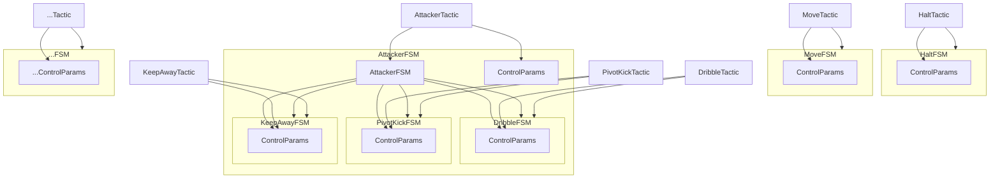
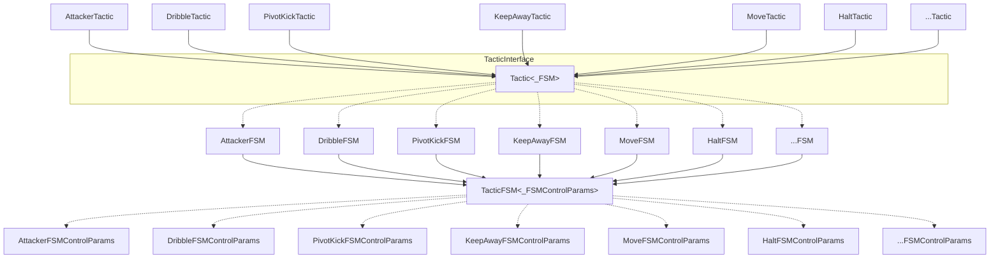
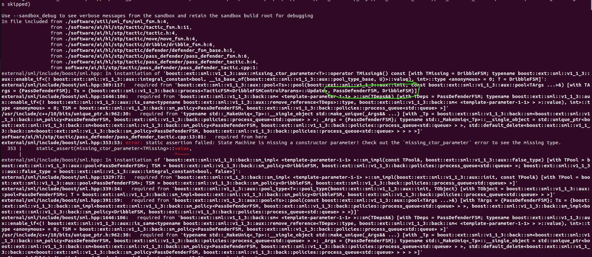

# A guide to our Tactic and Play classes

# Table of Contents

- [A guide to our Tactic and Play classes](#a-guide-to-our-tactic-and-play-classes)
- [Table of Contents](#table-of-contents)
- [Overview:](#overview)
- [Diagrams:](#diagrams)
  - [Description:](#description)
- [Advantages:](#advantages)
- [Build Errors and Debugging:](#build-errors-and-debugging)
  - [Naming Convention](#naming-convention)

# Overview:
The structure of our tactics and plays has undergone a significant change. The new system presents common features of each Play/Tactic/FSM in template classes which are then passed arguments and extended. Fundamental behaviour has not changed.

This documentation is written to accompany PR #3480. Some of it is basically my ramblings from when I was trying to get everything to compile. It's documented here for future me and current you.
# Diagrams:
I discuss tactics in the following section, but this applies to all plays that have been converted to FSMs.

If your ticket requires that you convert a play to an FSM, the following structures might be helpful.

The following approximately describes our old system's design for a few tactics:

Our new system is something like this:

## Description:
To create a tactic or a play, we always start with a class/struct that defines the controlling parameters for the play/tactic FSM. This is the `_ControParams` struct. From there, we feed it to the `PlayFSM` or `TacticFSM` template to generate a base class for our FSM. Then, more specific implementation details are provided by extending this base class and defining new functions (such as `updateControlParams()`). The resulting classes are the `AttackerFSM`, `HaltFSM`, etc. classes.

Using these FSM classes, we then generate Play or Tactic base classes with the template. Finally, we extend those base classes to create our Play or Tactic. The final result is our `AttackerTactic`, `HaltTactic`, etc. classes.

Some simple examples include `halt_play`, `halt_tactic`, `example_play`, and so on. They should all be pretty consistent.

Note that Tactics that require SubFSMs such as `AttackerTactic` now simply declare the usage of these SubFSMs when feeding template arguments to `Tactic<_FSM>`, instead of holding fields for those fields like a `DribbleFSM` field, which is harder to track and debug.
# Advantages:
One advantage of this new system are that each tactic implements a general `TacticInterface` and is based off a common base template class `Tactic<_FSM>`. While each tactic has slightly different code, the fundamental structure is very similar and therefore can be generated using the template and the base FSM (e.g. `Tactic<_FSM>` generates `done()`, `getFSMState()`, a constructor, and a few other utilities when given a TacticFSM class. See tactic.h for more details).

Similarly, the `TacticFSM` classes share a lot of very similar looking code. Writing a `TacticFSM<_FSMControlParams>` template allows us to generate the common utilities.

Another advantage is that Tactics with SubFSMs explicitly declare their SubFSMs in the class definition. `AttackerTactic` depends on `DribbleFSM`, `KeepAwayFSM`, and `PivotKickFSM`. Where before, this dependency was not super clear in the class declaration, it is now clearly stated, as `AttackerTactic` passes the `Tactic<_FSM>` template the four FSMs it needs (`AttackerFSM`, `DribbleFSM`, `KeepAwayFSM`, and `PivotKickFSM`). See `attacker_tactic.h` for an example.

# Build Errors and Debugging:
One of the most common and daunting errors I encountered while writing the refactor was this error here (The `missing_ctor_parameter` error): 
This error occurs when we fail to initialize a Tactic with the correct FSMs. For example, a `HaltTactic` is _always_ expecting a `HaltFSM`, and an `AttackerTactic` is _always_ expecting an `AttackerFSM`, `DribbleFSM`, `KeepAwayFSM`, and `PivotKickFSM`. If we fail to declare this in the class declaration, we get this error. You can fix this by looking for the text circled in green. That will tell you the FSMs/SubFSMs that the FSM is expecting.

Note that every single tactic, play, and FSM is expected a shared pointer to `ai_config`, regardless of it actually uses or not (a consequence of using templates. However, it does help to standardize constructors and initialization). 

You should always be either feeding an existing `ai_config_ptr` through to initialize a tactic/play/FSM, or, if you are working on tests or stuff that initializes a tactic/play/FSM, use `std::make_shared<TbotsProto::AiConfig>(ai_config)` to create the pointer. 

* If you know that the tactic/play/FSM being tested doesn't access `ai_config`, you can initialize it with `std::make_shared<TbotsProto::AiConfig>()`

Sometimes you may choose to declare a variable such as ai_config_ptr and pass it to every testing function (like in `play_factory_test.cpp`). If you get a segfault from this then you probably need to initialize that variable with `std::make_shared<TbotsProto::AiConfig>()`. (If you like, you can delete the initialization in `play_factory_test.cpp` and see this for yourself).

## Naming Convention
Look to the other files to get a sense of what the naming is. I've taken the time to standardize the naming and definitions of constructors and so on, so it should be pretty consistent.

# Other notable 'features'

It's a bit tricky to keep track of every available parameter. If you are looking at a tactic or play and are confused as to where certain fields are defined (like control_params) make sure you look at the super classes (all of them).

For every Play, there is a goalie tactic that is declared in `play.h`. This ended up being really important for debugging a segfault in `penalty_kick_enemy_play`, and it might help you as well.
