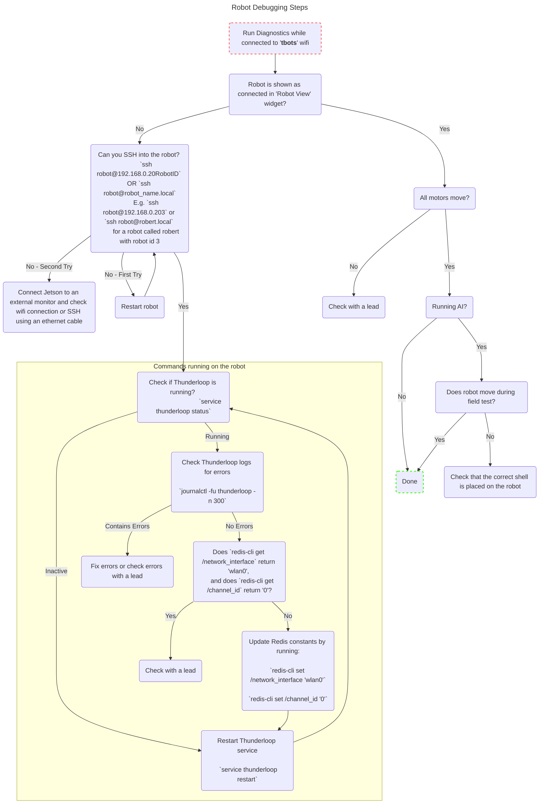

# Common Robot Commands

# Table of Contents
* [Common Debugging Steps](#common-debugging-steps)
* [Off Robot Commands](#off-robot-commands)
   * [Wifi Disclaimer](#wifi-disclaimer)
   * [Miscellaneous Ansible Tasks & Options](#miscellaneous-ansible-tasks--options)
   * [Flashing the nano](#flashing-the-nano)
   * [Flashing the powerboard](#flashing-the-powerboard)
   * [Setting up nano](#setting-up-nano)
   * [Robot Diagnostics](#robot-diagnostics)
   * [Robot Auto Test](#robot-auto-test)
* [On Robot Commands](#on-robot-commands)
   * [Systemd Services](#systemd-services)
   * [Debugging Uart](#debugging-uart)
   * [Redis](#redis)

# Common Debugging Steps

# Off Robot Commands

## Wifi Disclaimer

To use most of these commands you will either need to be on the tbots wifi network (no internet access) or on a wifi with internet access (shawopen, ubc wifi) and connected to the Jetson Nano through ethernet tethering. 

The IP address of the robots on the tbots network is `192.168.0.20<robot_id>` so for robot id `1` the IP is `192.168.0.201`. If you are using ethernet tethering you will need to use a network utility (tshark, wireshark, arp) to determine the IP address.

## Miscellaneous Ansible Tasks & Options

Individual miscellaneous tasks (ex reboot, shutdown, rtt test) can be run through the `misc.yml` playbook by specifying the corresponding tag.

To view a list of supported arguments, run  
`bazel run //software/jetson_nano/ansible:run_ansible --cpu=jetson_nano -- -h` 

If desired, the `-ho`, `--hosts` argument can be replaced with `-p`, `--port`, defining a port to listen to for Announcements from hosts.

The `--tags` argument can be used to specify which actions to perform and on which services.

## Flashing the nano

This will stop the current Systemd services, replace and restart them. Binaries that are used for Systemd services are located in a folder in `home/robot` (the default directory) called `thunderbots_binaries`.

<b>To build this for the first time you will need to run this with internet access. Then run it again on the tbots network</b>

<b>This will trigger motor calibration meaning the wheels may spin. Please elevate the robot so the wheels are not touching the ground for proper calibration.</b>

`bazel run //software/jetson_nano/ansible:run_ansible --cpu=jetson_nano -- --playbook deploy_nano.yml --hosts <robot_ip> --ssh_pass <jetson_nano_password>`

You could also use the `tbots.py` script to flash

`./tbots.py run run_ansible -f <robot_ids> -pwd <jetson_nano_password>` (Note that this uses robot IDs rather than full robot IP addresses)

Example: Flashing robots 1, 4, and 7

`./tbots.py run run_ansible -f 1 4 7 -pwd <jetson_nano_password>`

## Flashing the powerboard

This will flash powerloop, the current firmware in `software/power/`, onto the power board. It will prompt the user into setting the powerboard into bootloader mode by holding the boot button (left if looking from the back of the robot) and pressing the reset button (right if looking from the back of the robot), then releasing the reset button first, then the boot button. Once the board is flashed, pressing the reset button after to use the new firmware.  

Looking from the back of the robot the reset and boot buttons are on right side of the battery holder on the lowest board with the reset being on the left and the boot on the right. <b>Warning it may kick/chip when pressed.</b>

`bazel run //software/jetson_nano/ansible:run_ansible --cpu=jetson_nano -- --playbook deploy_powerboard.yml --hosts <robot_ip> --ssh_pass <jetson_nano_password>`

## Setting up nano 

This refers to setting up the Jetson Nano for the first time. This will enable Systemd services, modify device tree files and perform other setup necessary for the communication protocols used.

<b>Setting up the nano for the first time requires internet access</b>

`bazel run //software/jetson_nano/ansible:run_ansible --cpu=jetson_nano -- --playbook setup_nano.yml --hosts <robot_ip> --ssh_pass <jetson_nano_password>`

## Robot Diagnostics

Robot Diagnostics allow users to input various commands to the robots. It can be used to move the robot in the x, y and theta direction as well as kick, chip, autokick or autochip. It can also be used to spin the dribbler. 

<b>If multiple people are using robot diagnostics at the same time on the same network please make sure each person only connects to the robots they are testing via the checkboxes</b>

###For Just Diagnostics

From Software/src

`./tbots.py run thunderscope --run_diagnostics --interface <network_interface>`

###For AI + Diagnostics

From Software/src

`./tbots.py run thunderscope --run_blue --run_diagnostics --interface <network_interface>`

network_interface can be found with `ifconfig` commonly `wlp59s0` for wifi.

## Robot Auto Test
Runs the robot auto test fixture on a robot through Ansible, which tests the motor board and power board SPI and UART transfer respectively.

From Software/src:

`bazel run //software/jetson_nano/ansible:run_ansible --cpu=jetson_nano -- --playbook robot_auto_test_playbook.yml --hosts <robot-ip> --ssh_pass <jetson_nano_password>`
* replace the <robot-ip> with the actual ip address of the jetson nano for the ssh connection.
* replace the <jetson_nano_password> with the actual password for the jetson nano for the ssh connection.

# On Robot Commands

`ssh robot@<robot_ip>` can be used to connect to a robot.

## Systemd Services

Status shows whether the service is running and some recent logs. More logs can be found using `journalctl` shown below. More control can be achieved with `systemctl`. Valid `<service_name>` are `thunderloop`, `display`, and `wifi_announcements`  

`service <service_name> status`

Change whether the service is running or restart it. Valid `<run_command>` are `stop`, `start` and `restart`.

`service <service_name> <run_command>`
 
To view the full logs in vi/vim:  

`journalctl <service_name>`  

`Shift + g` to jump to bottom

`Shift + z` twice to exit

To follow the recent outputs to the log:

`journalctl -fu <service_name>`

## Debugging Uart

`screen` or [GNU screen](https://www.gnu.org/software/screen/) can act as serial monitor displaying what the jetson is receiving and allowing us to send characters through the terminal. 

For uart we use serial port: `/dev/ttyTHS1`  
For usb we use serial port: `/dev/ttyUSB0`  

The baudrate of powerloop is `460800` other programs will have different baudrates commonly `115200`. If the baudrate is incorrect you will see foreign characters.

Usage:

`screen <serial_port> <baudrate>`

Exiting:

`Ctrl-a` -> `k` -> `y` -> `enter`

Debugging:

If the serial_port is busy, screen will not launch and instead says `screen is terminating`. This may be because the port is in use either by thunderloop or another process running screen.

Powerloop uart communication is encoded so you can't read it from screen and will appear as a mix of foreign characters

Pressing the reset button once will send a status msg over its connected port. This is useful for sanity checking.

## Redis

Current redis keys that are used are available in `software/constants.h`.  Official Documentation [here](https://redis.io/docs/manual/cli/).

<b>Values should be strings. For example `set \ROBOT_ID "0"`</b>

Redis repl can be accessed through the following command.

`redis-cli`

Other common commands (once inside redis repl):

`get <redis_key>`

`set <redis_key> <value>`

To Exit:

`quit`

Alternative (without entering redis repl):

`redis-cli get <redis_key>` or `redis-cli set <redis_key> <value>`

