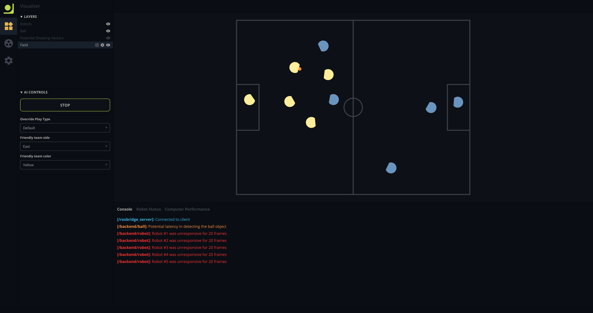

<p align="center">
  
  <br>
  <h1 align="center">Corner Kick</h1>
</p>

Corner Kick is a web app that allows for the visualization of UBC Thunderbots' AI.



**Table of content**

-   [How to use](#how-to-use)
-   [Contribute](#contribute)
    -   [Running the dev server](#running-the-dev-server)
    -   [Testing](#testing)
-   [Project Structure](#project-structure)
-   [Design notes](#design-notes)
    -   [Approach to the application UI layout](#approach-to-the-application-ui-layout)
        -   [React Portals](#react-portals)
    -   [Approach to the application state](#approach-to-the-application-state)
        -   [Reducer functions and Redux saga](#reducer-functions-and-redux-saga)

## How to use

You can start the visualizer by running:

```
roslaunch corner_kick corner_kick.launch
```

## Contribute

### Running the dev server

You can launch the application by running:

```
roslaunch rosbridge_server rosbridge_websocket.launch
```

and in another window:

```
yarn
yarn start
```

A window should open with the application in development mode.

### Testing

You can test the code by running

```
yarn test
```

To be able to run tests everytime a file changes, run

```
yarn test:watch
```

## Project Structure

The project is defined as follow:

-   `config` - contains webpack (build tool) configuration files
-   `launch` - contains roslaunch file
-   `src`
    -   `assets` - contains image assets
    -   `components` - contains repeatable UI components
    -   `containers` - contains high-level UI components (logger, visualizer, etc.)
    -   `constants` - contains fixed values used throughout the application
    -   `store` - contains logic for the application Redux state
    -   `style` - contains application styling and theming
    -   `types` - contains all Typescript types
    -   `utils` - contains misc code
-   `.prettierrc` - configuration for autoformating tool
-   `CMakeLists.txt` - cmake build script
-   `common.d.ts` - definition file for file assets
-   `package.json` - specifies dependencies, dev and build scripts.
-   `package.xml` - specifies ros dependencies
-   `tsconfig.json` - configuration file for typescript compiler
-   `tslint.json` - configuration for typescript linter
-   `yarn.lock` - autogenerated lock file for javascript dependencies

## Design notes

### Yarn

We are using a fixed version of Yarn in this project, to ensure that all developers
are using the same tooling for this project. As such, Yarn is included in this project
in the `scripts` directory. Regardless of the version of Yarn installed on your system,
it will detect the committed version and use that instead.

Currently, we are using Yarn version 1.13.0.

### Approach to the application UI layout

The visualizer will consist of multiple pages, each of which serve a single purpose. Each page will
be divided into sections as follow:

-   **Main:** Contains the primary focus of the page
-   **Sidebar title:** Contains the page title and additional options specific to the page
-   **Sidebar:** Contains additional controls or information relevant to the current page
-   **Sidebar control:** Contains navigation controls to switch between pages
-   **Console:** Contains views visible across the application
-   **Footer:** Contains simple breadcrumbs of information relevant to the application as a whole or to the current page

The application's primary layout is defined in [index.html](src/index.html). The theme for the application is defined
in [Theme.tsx](src/style/Theme.tsx)

#### React Portals

Access to those section in the React application is done via [React Portals](https://reactjs.org/docs/portals.html).
Portals are used to ensure the application layout is enforced throughout all the pages while offering an
easy way to access them.

In essence then, the sections of the application are boxes where the React application can insert React components into.
This allows us to insert and swap UI elements in the application without worrying about the global layout.

### Approach to the application state

We are using [Redux](https://redux.js.org/) to manage the application state. Simply put, in Redux, the state is an
immutable object. It can only be replaced by a new version of itself when some sort of action occurs in the application.
This action is captured by a reducer function, which accepts the current state and the action, and returns a new state,
with potentially new values based on the action received.

React, then, becomes an extension of the global Redux state and does not contain state of its own. When the global state
changes, the React UI will automagically change to adapt to the new state.

#### Debugging the Redux store

You can debug the Redux store by installing the Redux debugger on
[Chrome](https://chrome.google.com/webstore/detail/redux-devtools/lmhkpmbekcpmknklioeibfkpmmfibljd)
or [Firefox](https://addons.mozilla.org/en-US/firefox/addon/reduxdevtools/). It
allows to observe all actions and changes to the Redux state happening inside the application.

#### Reducer functions and Redux saga

Reducer functions are the cornerstone of the Redux approach. Once a Redux action is dispatched, reducer functions
determine what the new state will look like as a result of the action sent. Reducer functions do not permit for
any side-effects to ensure a deterministic behaviour. For a state and action, the same new state should be returned
by the reducer funtion. This, however, does not permit for more complex logic, such as communicating with ROS,
to occur. To allow for this, we introduce sagas, which can intercept and act on Redux action. They can conduct some
business logic work, and reflect the result of this work in the state by emmiting a Redux action when needed.

For more information about reducer functions, read the [official Redux doc on that topic](https://redux.js.org/basics/reducers).
For more information about Redux sagas, read the [official Redux saga doc](https://redux-saga.js.org/).
