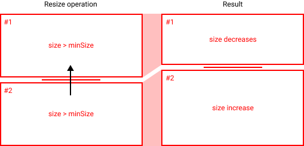
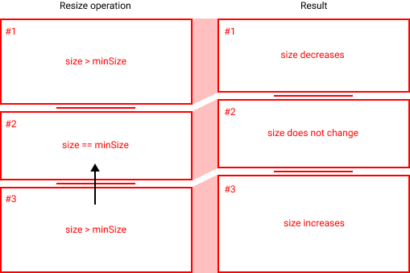
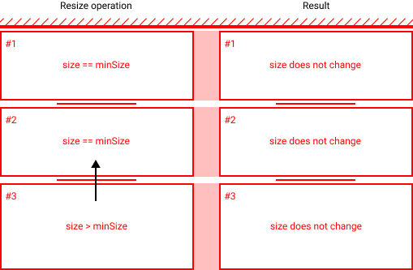

# Sidebar - Design notes<!-- omit in toc -->

This document outlines the design and implementation of the sidebar. The sidebar consists of a number
of developer specified panels containing various controls complementing the current page. Those pane
can be opened or closed and resized, allowing the entire sidebar UI to adapt to the user's current
needs.

## Table of content<!-- omit in toc -->

- [How to use](#how-to-use)
  - [Example](#example)
- [Implementation overview](#implementation-overview)
  - [The resize operation](#the-resize-operation)
    - [Scenario 1: both panel have sufficient height](#scenario-1-both-panel-have-sufficient-height)
    - [Scenario 2: a panel is at minimum height](#scenario-2-a-panel-is-at-minimum-height)
    - [Scenario 3: all panels are at minimum height](#scenario-3-all-panels-are-at-minimum-height)
  - [Opening/closing panels](#openingclosing-panels)
  - [Resizing the window](#resizing-the-window)
  - [Performance](#performance)

## How to use

The sidebar is composed of panels, which hold any custom UI specified by the developer. In this implementation,
panels are represented by a React component, which provides the sidebar with information on the title of the panel,
as well as its content.

The content of the sidebar (panels + resizeable logic) will automagically be added to the corresponding sidebar area in
the application layout.

### Example

The following gist creates a sidebar, adds it to the sidebar area in the application's main layout, and creates three panels
with the content specified inside the `<Panel>` tag

```JSX
<Sidebar>
    <Panel title="Layers">
        This is the content of the layers panel
    </Panel>
    <Panel title="AI Controls">
        This is the content of the AI control panel
    </Panel>
    <Panel title="Game Status">
        This is the content of the Game Status panel
    </Panel>
</Sidebar>
```

You do not have to worry about the size of the content inside the panels. If the panel size becomes smaller than that of its content,
a scrollbar will automagically be added to the UI to ensure the content is viewable.

## Implementation overview

As previously mentioned, the sidebar consists of a number of resizeable panels, which can be opened or closed by the user. A number
assumptions and design decisions had to be made, which will be described in this section.

**Note:** This section will remain sufficiently high level to ensure that it remains consistent with the actual implementation, in
case it changes

### The resize operation

It is important to view a resize operation as a transaction between two panels. The parent is fixed and the panels as whole take the
full height of the parent, so increasing the height of a panel must decrease the height of another panel and vice versa. An additional
constraint is that all panels have a minimum height that must be respected. Panels that are at their minimum height cannot have their
height decreased further.

This presents three different scenarios during a resize operation, which we will describe in detail

#### Scenario 1: both panel have sufficient height

<p align="center">
  
</p>

#### Scenario 2: a panel is at minimum height

<p align="center">
  
</p>

#### Scenario 3: all panels are at minimum height

<p align="center">
  
</p>

### Opening/closing panels

### Resizing the window

### Performance
