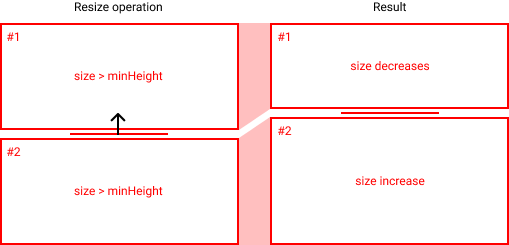
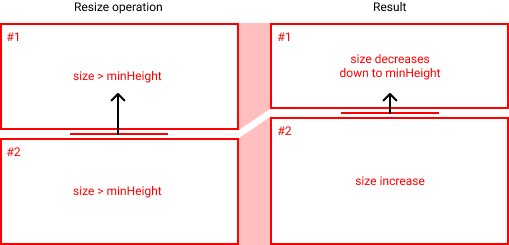
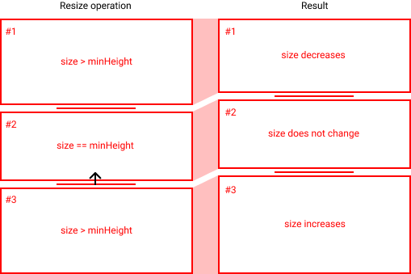
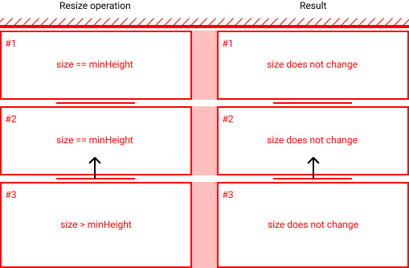

# Sidebar - Design notes<!-- omit in toc -->

This document outlines the design and implementation of the sidebar. The sidebar consists of a number
of developer specified panels containing various controls complementing the current page. Those pane
can be opened or closed and resized, allowing the entire sidebar UI to adapt to the user's current
needs.

## Table of content<!-- omit in toc -->

- [How to use](#how-to-use)
    - [Example](#example)
- [Implementation overview](#implementation-overview)
    - [The resize operation](#the-resize-operation)
        - [Scenario 1: both panel have sufficient height](#scenario-1-both-panel-have-sufficient-height)
        - [Scenario 2: a panel is almost at minimum height](#scenario-2-a-panel-is-almost-at-minimum-height)
        - [Scenario 3: a panel is at minimum height](#scenario-3-a-panel-is-at-minimum-height)
        - [Scenario 4: all panels are at minimum height](#scenario-4-all-panels-are-at-minimum-height)
    - [Opening/closing panels](#openingclosing-panels)
        - [Closing a panel](#closing-a-panel)
        - [Opening a panel](#opening-a-panel)
    - [Resizing the window](#resizing-the-window)
    - [Performance](#performance)

## How to use

The sidebar is composed of panels, which hold any custom UI specified by the developer. In this implementation,
panels are represented by a React component, which provides the sidebar with information on the title of the panel,
as well as its content.

The content of the sidebar (panels + resizeable logic) will automagically be added to the corresponding sidebar area in
the application layout.

### Example

The following gist creates a sidebar, adds it to the sidebar area in the application's main layout, and creates three panels
with the content specified inside the `<Panel>` tag

```JSX
<Sidebar>
    <Panel title="Layers">
        This is the content of the layers panel
    </Panel>
    <Panel title="AI Controls">
        This is the content of the AI control panel
    </Panel>
    <Panel title="Game Status">
        This is the content of the Game Status panel
    </Panel>
</Sidebar>
```

You do not have to worry about the size of the content inside the panels. If the panel size becomes smaller than that of its content,
a scrollbar will automagically be added to the UI to ensure the content is viewable.

## Implementation overview

As previously mentioned, the sidebar consists of a number of resizeable panels, which can be opened or closed by the user. A number
assumptions and design decisions had to be made, which will be described in this section.

**Note:** This section will remain sufficiently high level to ensure that it remains consistent with the actual implementation, in
case it changes

### The resize operation

A resize operation when the user clicks near the bottom of a panel. This area is highlighted with the cursor changing to a resize symbol.
Once the operation begins, the resizing logic is triggered once every frame, to sync the mouse movement with the height of the panels.
Every time the cursor moves, its vertical movement (delta) is measured and added to a movement counter. The value of
the counter is used to perform the resize operation.

It is important to view a resize operation as a transaction between two panels. The parent is fixed and the panels as whole take the
full height of the parent, so increasing the height of a panel must decrease the height of another panel and vice versa. An additional
constraint is that all panels have a minimum height that must be respected. Panels that are at their minimum height cannot have their
height decreased further.

The currency of this transaction is the amount of mouse movement that occured between frames. This value is
stored in the movement counter, which we will refer to as `mouseDelta`. If the transaction, aka the transfer of height between
two panels, was performed successfully, `mouseDelta` is reset to 0. If the transaction was not performed in full (aka the transfer
of height happened partially), `mouseDelta` will be reduced by the amount of height successfully transferred between two panels.
If the transaction is unsuccessful, `mouseDelta` will not change.

Why do we do this? This is to ensure that the mouse position accurately follows the position of the resize handle throughout the resize
operation, up and until the resize operation cannot be performed further due to some constraint. If the constraint is removed (most likely
due to the mouse moving in the other direction), we want to be able to sync back the mouse position with the resize handle. In essence then,
`mouseDelta` describes the delta between the mouse position and the resize handle.

Due to the constraints in the resize operations, there are four different scenarios that we have to account for.

#### Scenario 1: both panel have sufficient height

<p align="center">
  
</p>

In the case where both panels have sufficent height, then the panel surround the resize handle
(in this example panel #1 and #2) will take part in the height transaction. After the resize
logic has run, panel #1's height will be reduced by the amount specified in `mouseDelta` (here,
the black arrow) and panel #2's height will be increased by the amount specified in `mouseDelta`.

#### Scenario 2: a panel is almost at minimum height

<p align="center">
  
</p>

In the case that a panel is not at its minimum height, but following scenario 1 would cause it
to have its height reduced past its miminum height, not all of `mouseDelta` will be used in the
height transaction. In this example, panel #1's height would be reduced until reaching its minimum
height and panel #2's height would be increased by the same amount. `mouseDelta` value would be
reduced by the amount used in this transaction and the remaining value would be kept for the
following frame, which would most likely follow scenario 3.

#### Scenario 3: a panel is at minimum height

<p align="center">
  
</p>

If a panel is at minimum height, its height cannot be reduced further. The resize logic must then
look at the next panel if it has a height suitable for this transaction. In this example, panel #2
is at its minimum height, but panel #1 is not. Hence, the height transaction can occur between
panel #3 and panel #1, following either scenario 1 or 2.

#### Scenario 4: all panels are at minimum height

<p align="center">
  
</p>

If there are no panels with a height greater than the minimum height, then no transaction can occur.
`mouseDelta` is not changed, and no panel has their height modified.

### Opening/closing panels

Panels can be opened or closed by the user. This has an effect on panel's height. There are two scenarios to take into account.

#### Closing a panel

In this instance, the panel being closed must have its height assigned to other opened panels.

The only edge case is if there are no other panel opened (the panel just closed was the last one
open). In this case, the closed panel's height is reduced and no height is assigned to other panels.

#### Opening a panel

Here, we need to take height from other panel to make sure the recently opened panel's height is
above its minimum height. We attempt transfer sufficient height from other open panel until the
newly opened panel is at its minimum height.

The only edge case is if the newly opened panel is the only panel open. In that case, the panel will
take the height of its parent, minus the height of the closed panels.

### Resizing the window

When resizing the window, we must ensure the height of all panels must not go over the height of the
parent. When the window is resized, we apply the change in window height to the bottom-most
opened panel.

We also simplify the resize logic by mandating that the panel container cannot be smaller than
the sum of the minimum height of all panels.

### Performance

Performance for resizing panels is critical. In this situation, relying on React to
perform height is not beneficial. The reconciliation process is too expansive to be
conducted 60 times per second. Rather, we assign unique ids to each panel and modify
the height using CSS styling. This prevents a React rerender and improves the frame
rate of the resize.

In addition, we use the CSS instruction `position: absolute` on the panels to remove
them from the page flow. This helps with our frame rate by preventing a browser reflow.
